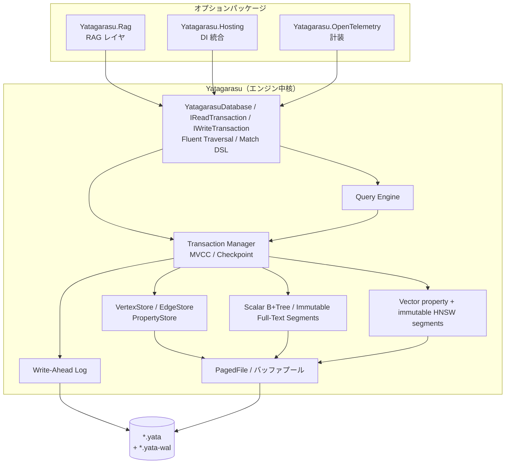
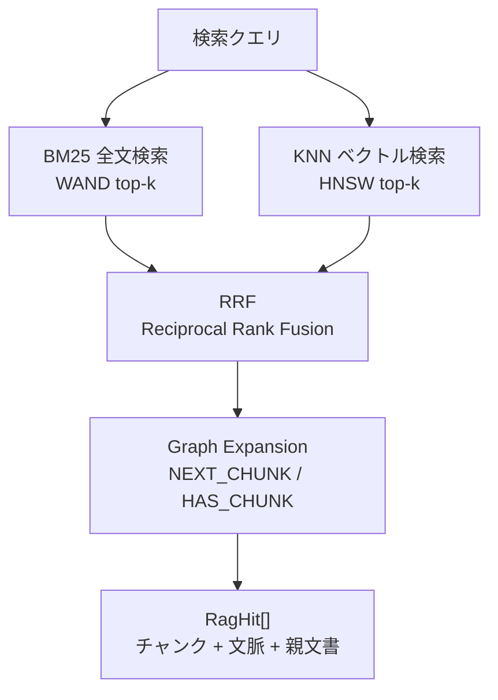
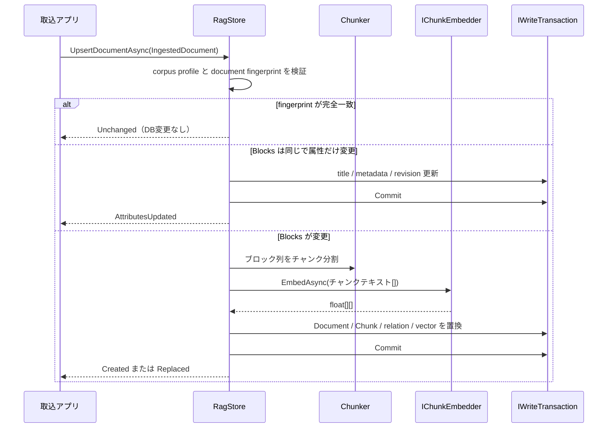
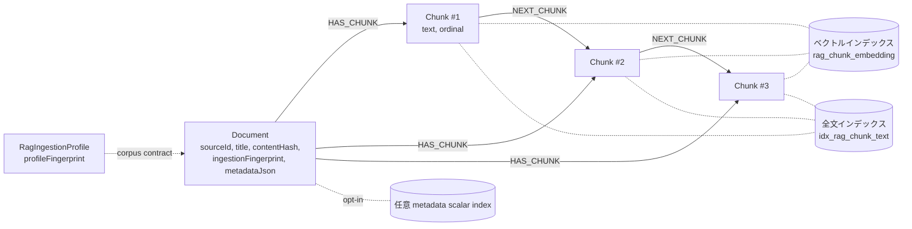
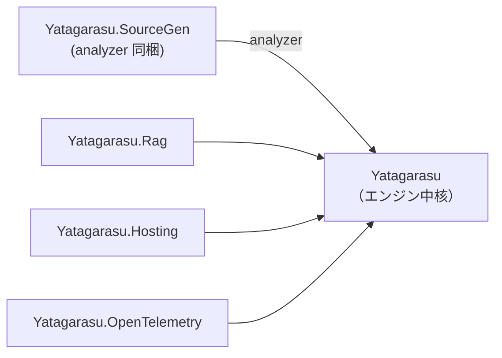

# Yatagarasu アーキテクチャ図

用途別の Mermaid 図集。
内部実装の契約は[現行仕様](spec/00_overview.md)を参照。

---

## 1. レイヤ概要

エンジン中核の内部レイヤと、オプションパッケージの依存関係を示す。

---

## 2. ハイブリッド検索

BM25 全文検索と KNN ベクトル検索を RRF で統合し、Graph Expansion で文脈を復元する。

---

## 3. 文書取込（Yatagarasu.Rag）

外部アプリが生成した正規化ブロック列を `RagStore` が受け取り、グラフに格納する。

---

## 4. RAG スキーマ

`Yatagarasu.Rag` が構築するグラフ構造を示す。

---

## 5. パッケージ依存関係

NuGet パッケージとしての依存グラフ。矢印はパッケージ参照の向きを示す。

