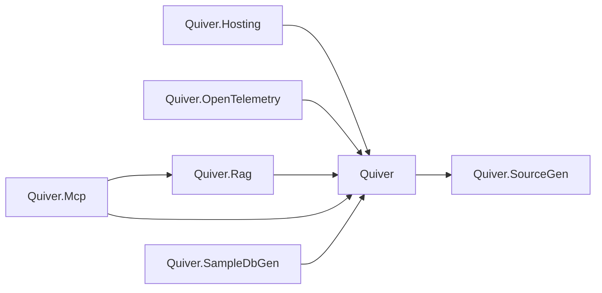

<!-- Generated by scripts/generate-docs.ps1. Do not edit. -->

# Generated architecture inventory

This document is generated from `Quiver.slnx`, project files, and source namespace declarations.

## Production projects

| Project | Group | Path | Direct project references | External packages |
|---|---|---|---|---|
| `Quiver` | src | `src/Quiver/Quiver.csproj` | `Quiver.SourceGen` | None |
| `Quiver.Hosting` | src | `src/Quiver.Hosting/Quiver.Hosting.csproj` | `Quiver` | `Microsoft.Extensions.Configuration.Abstractions`, `Microsoft.Extensions.Configuration.Binder`, `Microsoft.Extensions.DependencyInjection.Abstractions`, `Microsoft.Extensions.Logging.Abstractions`, `Microsoft.Extensions.Options`, `Microsoft.Extensions.Options.ConfigurationExtensions` |
| `Quiver.OpenTelemetry` | src | `src/Quiver.OpenTelemetry/Quiver.OpenTelemetry.csproj` | `Quiver` | `OpenTelemetry`, `OpenTelemetry.Api` |
| `Quiver.Rag` | src | `src/Quiver.Rag/Quiver.Rag.csproj` | `Quiver` | None |
| `Quiver.SourceGen` | src | `src/Quiver.SourceGen/Quiver.SourceGen.csproj` | None | `Microsoft.CodeAnalysis.Analyzers`, `Microsoft.CodeAnalysis.CSharp` |
| `Quiver.Mcp` | tools | `tools/Quiver.Mcp/Quiver.Mcp.csproj` | `Quiver`, `Quiver.Rag` | `Microsoft.Extensions.Hosting`, `ModelContextProtocol` |
| `Quiver.SampleDbGen` | tools | `tools/Quiver.SampleDbGen/Quiver.SampleDbGen.csproj` | `Quiver` | None |

## Project dependency graph

## Source namespaces

| Namespace | C# files |
|---|---:|
| `Quiver` | 28 |
| `Quiver.Api` | 24 |
| `Quiver.Api.Internal` | 2 |
| `Quiver.Api.Match` | 4 |
| `Quiver.Codec` | 1 |
| `Quiver.Core` | 16 |
| `Quiver.Hosting` | 3 |
| `Quiver.Index` | 6 |
| `Quiver.Index.FullText` | 5 |
| `Quiver.Index.Vector` | 1 |
| `Quiver.Logical` | 6 |
| `Quiver.Maintenance` | 5 |
| `Quiver.Migrations` | 5 |
| `Quiver.OpenTelemetry` | 1 |
| `Quiver.Query.Logical` | 1 |
| `Quiver.Query.Optimizer` | 2 |
| `Quiver.Query.Physical` | 52 |
| `Quiver.Rag` | 12 |
| `Quiver.SourceGen` | 9 |
| `Quiver.Storage` | 15 |
| `Quiver.Storage.Records` | 51 |
| `Quiver.Storage.Wal` | 11 |
| `Quiver.Telemetry` | 2 |
| `Quiver.Text` | 8 |
| `Quiver.Transactions` | 23 |
