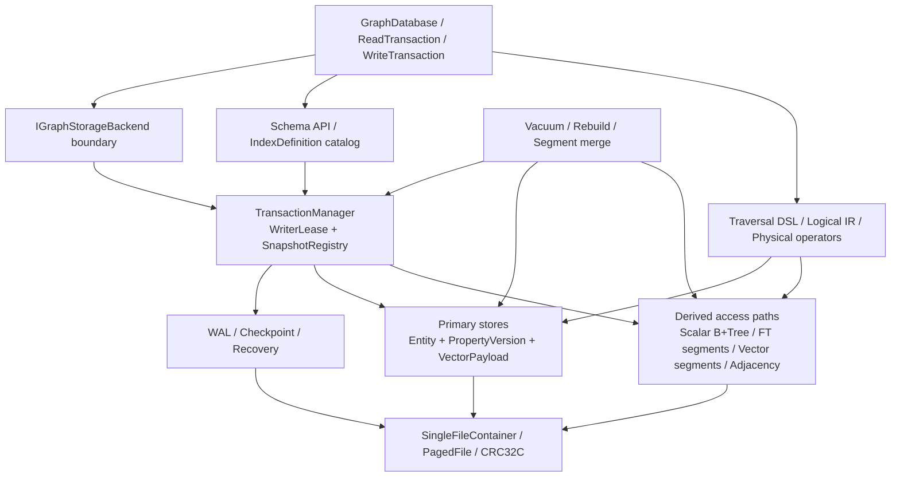
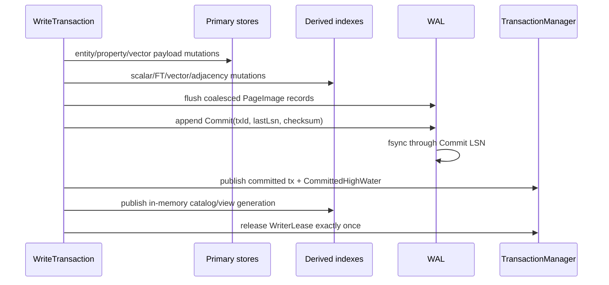

# Single Writer + Snapshot Readers 抜本再設計

> 設計正本。基点 commit: `ee811d1a3672fb96ad8bebfdeb036099cbaf7540`。
> 本書は旧 DB、旧 WAL、旧 public API との互換を持たない clean break の実装依存順を定める。
> `plans/clean-slate-redesign.md` で確定した「COW は不採用、ARIES を継続」の決定を引き継ぐ。

## 0. 本書の効力と決定要約

本書は Single Writer 再設計トラックの設計正本である。
本書と `docs/spec/`、`docs/design/`、`quiver-implement` skill が食い違う期間は、本トラックに限り本書を優先する。
実装ウェーブ 0 で as-built と skill を本書へ揃え、矛盾期間を終わらせる。

過去コミットの完了要約は、その時点の実装を説明する historical record であり削除も改竄もしない。
一方、過去の依存マップ、推奨着手順序、「完了済みなので再実装しない」という運用規則は historical record ではなく、旧トラック向けの実装指示である。
Single Writer 再設計では、これらの旧実装指示を本書で上書きする。

確定事項は次のとおりである。

- 並行性は **1 writer + 任意数の snapshot reader** だけを提供する。
- writer 排他は facade の便宜機能ではなく、`IGraphStorageBackend` と `TransactionManager` の双方で強制する。
- 最終 public contract の分離レベルは snapshot isolation だけとする。`ReadCommitted` と `Serializable` の実装分岐は Wave 4、public enum と旧開始 API は Wave 6 で削除する。
- `xmin` / `xmax`、Generation、WAL、CRC32C、crash recovery、checkpoint、vacuum は維持する。
- SSN、pstamp/sstamp、`SsnContext`、`SerializabilityException`、`LockManager`、ReaderWriter mode、`DeadlockDetector` は削除する。
- target entity は Vertex、Edge、Nexus の三種類である。Property は entity ではなく、owner に束縛された versioned value である。
- Wave 2 で現行の Node、Relationship、Hyperedge から target vocabulary へ原子的に切り替え、database facade を `QuiverDatabase` とする。
- Scalar、FullText、Vector index は property を検索する再構築可能な access path である。index 種別を `EntityKind` に表現しない。
- 大きな vector は property record に inline せず、`VectorPayloadStore` に immutable payload として置く。property version は `VectorPayloadRef` を持つ。
- ストレージは新しい file magic と format family を持つ。旧 Format V1〜V5、旧 WAL、旧 API を読む互換コードは持たない。
- 未決定事項はない。性能値は採用判断ではなく、各ウェーブの回帰ゲートとして baseline と比較する。

### 0.1 domain vocabulary

Wave 2 完了後の Quiver は、次の語彙だけを graph domain の public contract と active implementation に使用する。

| 現行語 | target 語 |
|---|---|
| `Node`, `NodeId`, `NodeStore`, `CreateNode` | `Vertex`, `VertexId`, `VertexStore`, `CreateVertex` |
| `Relationship`, `RelationshipId`, `RelationshipTypeId`, `CreateRelationship` | `Edge`, `EdgeId`, `EdgeTypeId`, `CreateEdge` |
| `Property` | `Property` |
| `Hyperedge`, `HyperedgeId`, `HyperedgeTypeId`, `HyperedgeMember` | `Nexus`, `NexusId`, `NexusTypeId`, `NexusMember` |
| `GraphDatabase`, `GraphDatabaseOptions` | `QuiverDatabase`, `QuiverDatabaseOptions` |

複合識別子、method、file、test、sample、Source Generator、query slot、telemetry field、logical mutation、永続 record 名も同じ対応で変更する。
複数形は `Vertices`、`Edges`、`Nexuses` とする。
`IGraphVertex`、`IGraphEdge`、`IGraphNexus` のように graph model を表す `Graph` は維持する。
`GraphTraversal`、graph algorithm、B-tree node、syntax node、HNSW node など、Quiver の domain entity を指さない一般用語はこの置換対象ではない。
旧名の type alias、forwarder、extension alias、obsolete shim、JSON field fallback、Source Generator の二重出力は作らない。
旧名を許すのは Git history、Wave 2 以前の fixture を拒否する test、decision log が過去 API を引用する箇所だけである。
§7 の disposition 表で backtick に入った旧 file/type 名は Wave 2 着手時の入力名を示し、target 名を示さない。

## 1. 目的・非目標

### 1.1 目的

目的は、Quiver の実際の利用契約を内部構造へ正直に反映することである。
現行実装は facade に writer gate を足した一方、backend SPI と `TransactionManager.Begin` は複数 writer を開始できる。
その下には multi-writer を前提にした entity lock、wait queue、deadlock 検出、SSN stamp が残り、snapshot reader のために必要な MVCC より大きい状態空間を保守している。

再設計後は、writer が一つであることを利用して次を達成する。

- writer 間競合を「解決」するコードをなくし、競合自体を backend 境界で発生させない。
- reader は lock を取得せず、開始時の snapshot を最後まで読む。
- primary data と derived access path の責務を分け、壊れた index を primary data から再構築できるようにする。
- Property と vector の二重所有をやめ、vector を property value の一表現として扱う。
- 旧形式互換の分岐を削除し、commit と recovery の根拠を明瞭にする。
- 有用な pager、B+Tree、tokenizer、query operator、Generation、WAL I/O、crash test を再利用する。

### 1.2 非目標

- 複数 writer の同時進行、writer fairness の高度な scheduler、group commit は提供しない。
- Serializable、SSI、SSN、predicate lock、entity lock、deadlock detection は提供しない。
- 旧 DB、旧 WAL、旧 public API の自動移行、互換 reader、obsolete shim は提供しない。
- サーバモード、複数プロセス同時 open、分散 transaction、replication protocol は追加しない。
- Property に独立した利用者向け identity を与えない。
- HNSW、全文 postings、scalar B+Tree を primary data にしない。
- COW shadow paging を再導入しない。再検討には `plans/clean-slate-redesign.md` が定めた新 spike が必要である。

## 2. 設計原則と不変条件

### 2.1 writer 所有権

1. `TransactionManager` は database instance ごとに一つの `WriterLease` を所有する。
2. write transaction、bulk load、schema mutation、migration、vacuum、checkpoint、index rebuild の publish、segment merge の publish はすべて同じ lease を取得する。
3. `GraphDatabase` は使いやすい公開入口として待機か即時失敗を選ぶが、正しさの根拠にはしない。
4. `IGraphStorageBackend.BeginWriteTransaction` を直接呼んでも `TransactionManager.BeginWrite` を迂回できない。
5. custom backend は backend contract test で二本目の writer を拒否または待機させなければならない。
6. lease は commit、abort、commit なし dispose、commit 失敗、durable commit 後の publish 失敗による faulted 遷移の全経路で一度だけ解放する。faulted instance は lease 解放後も新しい operation を受け付けない。
7. 同じ transaction handle の同時使用は `ConcurrentTransactionUseException` とする。`ThreadStatic` / ambient write context は使わない。

### 2.2 snapshot reader

1. reader は開始時に `Snapshot(CommittedHighWater, AbortedGaps, ActiveWriterId?)` を取得する。
2. reader は WAL を書かず、writer lease も entity lock も取得しない。
3. writer は reader の終了を待たずに commit できる。
4. reader は開始後に commit した version を観測しない。
5. version `v` は、`xmin` が snapshot から committed と見え、かつ `xmax` が snapshot 時点で未 committed のときだけ可視である。
6. writer transaction 自身の読み取りには自己可視性の例外を適用する。`xmin = selfTxId` の version は committed 扱いで可視、`xmax = selfTxId` の version は削除済み扱いで不可視とする。同一 transaction 内の create → read → update は常に自分の最新の書き込みを観測する。
7. savepoint rollback で undo された version は、`WalWriteSet` の before-image 適用によって write set とメモリ内 page から取り除かれる。したがって rollback 後の読み取りは savepoint時点の状態を観測し、undo 済み version に対する追加の可視性規則は必要ない。
8. 自己可視性の例外は writer 自身にだけ適用する。並行する reader の snapshot は active writer の txId を committed とみなさないため、5 の規則だけで writer の未 commit 書き込みを観測しない。
9. read transaction の登録は vacuum horizon の計算にだけ使い、read path の相互排他には使わない。
10. page frame の短時間 read/write latch は物理メモリ安全性のために残す。transaction lock ではなく、snapshot 意味論を担わない。
11. dispose されない reader を安全のため強制失効しない。`SnapshotRegistry` は active snapshot count、oldest snapshot age、開始位置を診断 API へ公開し、閾値超過を警告する。test は reader handle と cursor の dispose 漏れを反復検査する。

### 2.3 identity と version

- `EntityRef = (EntityKind, Generation, Sequence)` が target architecture の entity identity の唯一の表現である。internal `EntityId` の統合は TransactionManager rewrite と同じ Wave 4 で行う。
- public `EntityRef` の論理形は `(EntityKind Kind, long Value)` とするが、raw constructor は private にする。`Value` は kind を除く `PackLocal(Sequence, Generation)` であり、`Id = Sequence` という旧契約は削除する。`Sequence` と `Generation` を instance property として公開する。既存 static helper は `UnpackSequence(long)` / `UnpackGeneration(long)` へ改名し、member 名を衝突させない。
- public construction は `From(NodeId)`、`From(RelationshipId)`、`From(HyperedgeId)` と `Create(EntityKind, sequence, generation)` に限定する。`From` に渡した typed ID が Invalid のときだけ `default(EntityRef)` を返す。`EntityId.Invalid` と packed 値 `0` は canonical Invalid である。非0の Property、予約値、未知 kind は `Create`、`Pack`、`EntityId` の生成と packed 値からの変換で `ArgumentOutOfRangeException` を返す。`EntityRef.IsValid` は Kind が Node(1)、Relationship(2)、Hyperedge(4) のいずれかで、かつ Value が非負のときだけ真である。`UnpackKind` は packed bit の raw 抽出であり、生成境界ではないため kind を検証しない。`Create` は三つの有効 kind、sequence/generation 範囲、local Value に kind bit がないことを検証し、不正値を reject する。`default(EntityRef)` だけを invalid sentinel として許す。typed ID からは full `Value` を失わずに変換する。
- physical record の Sequence は内部 address だけを表す。logical emit/key、public API、query/traversal、index output は sidecar の `CurrentGeneration` で full typed ID を materialize する。Generation `0` の typed ID は内部 physical address に限定し、public identity として emit しない。Generation `> 0` の入力は sidecar と照合して stale を reject し、derived entry の世代不一致は stale として skip する。relationship/incidence が保持する Sequence は slot 再利用後の別 entity へ retarget してはならない。
- owner Sequence は、参照する relationship/incidence が当該 read snapshot から論理不可視になり、かつ reader horizon を越えるまで再利用しない。owner delete は参照 relationship/incidence を同じ logical delete 境界で無効化する。したがって `CurrentGeneration` による materialization は、同じ live owner だけを表す。
- relationship の physical raw Sequence は base、delta、locator、epoch entry に残してよいが、transaction/query/traversal の logical boundary でだけ materialize する。Wave 1 では relationship Sequence を再利用しない。`Vacuum` は reclaim 済み relationship の storage を回収しても free list へ Sequence を release せず、create は free 候補を無視して high-water mark からだけ割り当てる。このため raw entry が残っていても ABA は起きない。reader horizon、base rebuild、delta/epoch reset、locator rebuild、derived durable の順序を満たす再利用解放は Wave 9 の `RelationshipReuseCoordinator` だけが行う。materialization に失敗した candidate は skip/not-found にする。
- `EntityKind` は `Node(1)`、`Relationship(2)`、`Hyperedge(4)` だけを持つ。現行の永続 byte と public enum 値を維持し、削除する `Property(3)` の値は予約欠番として再利用しない。
- typed ID (`NodeId` 等) の equality は packed identity 全体を比較する。現行の Generation を無視する equality は削除する。
- Generation は slot incarnation であり、`xmin` / `xmax` は logical version visibility である。両者を混同しない。
- vacuum 後に sequence を再利用するときだけ Generation を進める。wrap した slot は永久退役する。
- logical pipeline は full typed ID を保持する。node query/traversal が physical store に入る直前だけ full typed `NodeId` を primary `Read` で検証し、その直後の `Sequence` を物理 locator、chain、index key に渡す。検証前の sequence から logical ID を再構成してはならない。
- physical access path の candidate または出力を logical pipeline へ返すときは、current generation と primary `Read` で full typed ID を materialize し、stale candidate を skip する。`LabelNodeIndex.Lookup` は logical API であり full `NodeId` だけを返す。diagnostic raw `long` は表示・計測にだけ使い、traversal、query、transaction の入力に渡さない。
- public `EntityCandidateSet` と filtered vector の direct raw-long contract は Wave 7 で削除するまでの内部物理ブリッジであり、互換性を保証する public contract ではない。node query/traversal が physical lookup に渡すのは full typed `NodeId` を primary `Read` で検証した直後の `Sequence` だけである。ブリッジが受けた direct raw long を logical identity、logical output、または未検証の query/traversal input として再利用してはならない。
- Property、incidence、index entry、vector payload、segment は entity ではない。必要なら内部物理参照を持つが `EntityRef` に詰めない。

### 2.4 primary data と access path

primary data は entity header、relationship endpoint、hyperedge member、property version、vector payload、token、schema/index definition である。
scalar B+Tree、全文 segment、vector segment/HNSW、adjacency segment、co-membership view は derived data である。
column cache は本トラックで削除する。将来再導入する場合も derived data として扱う。

- index definition は primary metadata なので WAL と checkpoint の対象である。
- derived structure の更新も通常 commit では同じ WAL transaction に含め、commit 時点で base と index を揃える。
- derived structure は property version への参照を持ち、snapshot visibility を必ず再検証する。
- derived structure の checksum 不整合や欠落は base corruption と区別する。definition と primary data が健全なら read snapshot から immutable artifact を構築し、writer lease 下の短い publish transaction で切り替えられる。
- index を drop しても property は失われない。vector index を drop しても vector property payload は失われない。

### 2.5 durability

- commit 成功の根拠は checksum が有効な `Commit` WAL record の fsync だけである。
- `PageImage` があることを commit 推定に使わない。現行の presume-committed 分岐は削除する。
- buffer 管理は no-steal / no-force とする。未 commit transaction が上書きした dirty page は `Commit` の fsync まで data file へ書かない。commit 時に data page の flush も強制しない。
- 例外として、committed allocation high-water を超えて新規確保した page への append は commit 前に data file へ書いてよい。これらの page は commit まで committed root と allocation metadata から到達不能なので、Commit が無ければ recovery の対象にならず free のままである。
- WAL-before-data は committed 構造から到達可能な page に適用する。到達可能な data page を書けるのは、その page の最終更新 LSN までの WAL record が durable になった後だけである。前項の到達不能な新規 page はこの順序規則の例外だが、利用者へ公開する Commit の fsync 前に対応する PageImage を WAL へ書く。
- recovery は redo-only とする。checksum が有効な `Commit` を持つ winner の after-image を page LSN と比較して冪等に redo する。loser の書き込みは no-steal により committed page へ到達していないため、undo pass を持たない。
- checkpoint は writer lease を取得する sharp checkpoint とする。active writer の終了後に `CheckpointBegin` を fsyncし、committed dirty page を WAL-before-data 順序で全 flushし、`CheckpointEnd` を fsyncしてから古い WAL を truncate する。reader の終了は待たない。
- active writer 中は checkpoint を開始しない。未 commit の既存 dirty frame が buffer pool の安全容量を超える場合は transaction を `TransactionTooLargeException` で abort し、bulk loader は chunk commit を使う。未 commit page を eviction して no-steal を破らない。
- page と WAL record は CRC32C を持ち、未知 record type、長さ超過、checksum 不一致を黙って読み飛ばさない。

## 3. 目標アーキテクチャ



書き込み経路は必ず `BACKEND -> TransactionManager.WriterLease` を通る。
読み取り経路は `SnapshotRegistry` に短い登録を行った後、primary store と snapshot-aware access path を lock-free に走査する。

## 4. CRUD / commit / recovery / traversal / vector / full-text の処理フロー

### 4.1 CRUD

**Create entity**

1. write transaction が `WriterLease` を既に持つことを検証する。
2. slot を確保し Generation を決め、entity header を `xmin = writerTxId, xmax = 0` で追加する。
3. 初期 property を owner-bound version として追加する。
4. relationship/hyperedge の構造差分を primary store に書き、adjacency/incidence access path を更新する。
5. scalar/full-text/vector definition に一致する property だけ、derived access path の commit batch に追加する。

**Read entity/property**

1. typed ID の Generation を正本と照合する。不一致は not found であり別 entity へ alias しない。
2. entity header を snapshot visibility で判定する。
3. property chain から address と snapshot に合う version を選ぶ。
4. vector ref の場合だけ `VectorPayloadStore` から payload を読む。

**Update/Delete**

1. entity の immutable fields は変更せず、property は version を追加する。
2. entity delete は header の `xmax` を設定する。relationship/hyperedge の構造 entry は即時物理削除しない。
3. index entry は旧 snapshot のため残し、新 version/tombstone を追加する。
4. vacuum は horizon を越えた derived entry を先に回収し、property version とそれだけが参照する payload を同じ write transaction で回収する。その後に incidence と entity slot を回収する。stale derived entry が残っても candidate revalidation により primary corruption とは扱わない。

### 4.2 commit



`Commit` より前に失敗した場合は、`WalWriteSet` がメモリ内に保持する before-image を逆順適用して abort する。この undo はメモリ内で完結し、WAL へ undo record を書かない。no-steal により未 commit の上書き page は data file に存在しないため、data file の巻き戻しも不要である。
`Commit` fsync 後に利用者へ例外を返す実装は、reopen で committed か aborted か曖昧になるため禁止する。
fsync 後の in-memory publish が失敗した場合は database instance を faulted にし、再 open/recovery を要求する。durable commit 自体は取り消さない。

### 4.3 recovery

1. database magic、format family、page checksum を検証する。
2. 最後の完了済み checkpoint を決める。Begin 単独は無視する。
3. WAL record checksum を検証し、tx table と dirty page table を構築する。
4. checksum が有効な `Commit` を持つ winner の after-image だけを page LSN 順に redo する。`Commit` を持たない tx は redo 対象から除外するだけでよい。no-steal により loser の上書きは data file に到達しておらず、新規確保 page は catalog 上 free のままなので、undo pass は存在しない。
5. committed registry、next tx id、slot ごとの Generation high-water を checkpoint 済み primary catalog から復元する。catalog checksum が有効なら全 slot scan を行わない。catalog が不健全な場合だけ consistency repair mode の明示的 full scan を要求する。
6. index definition を開き、derived structure の manifest/checksum を検証する。不健全なら `RebuildRequired` にする。
7. writer を受け付ける前に必須 access path を rebuild する。任意 index は query を base scan に fallback させ、明示 rebuild も選べる。
8. recovery 完了 checkpoint を書いてから通常 open を返す。

旧 WAL record、旧 page payload V1/V2/V3、旧 checkpoint record を解釈しない。
旧 magic または旧 WAL magic は `StorageFormatMismatchException` / `WalFormatMismatchException` で拒否する。

### 4.4 traversal

1. planner は read transaction の snapshot を全 operator へ明示的に渡す。
2. seed は scalar/full-text/vector access path または primary scan から候補 owner を得る。
3. access path の候補は PropertyVersionRef と owner Generation を primary store で再検証する。
4. expand は immutable adjacency base segment と writer delta のうち snapshot から visible な関係だけを merge する。
5. relationship/hyperedge/property の predicates は同じ snapshot で評価する。
6. result cursor は transaction より長生きできない。cursor が snapshot を暗黙複製しない。

### 4.5 vector

**write**: `SetVectorProperty(owner, key, values)` は payload を immutable appendし、property version に ref を設定し、visible な `VectorIndexDefinition` ごとに flat delta segment entry を同じ commit に追加する。

**search**: snapshot から visible な immutable HNSW segment と flat delta segmentを fan-out 検索し、top-k を mergeする。各候補の owner Generation、property version visibility、payload ref を再検証する。merge は read snapshot から lease 外で immutable HNSW segment を構築する。構築後に writer lease を取得し、source manifest generation が変わっていないことを再検証してから、旧/new manifest の `xmin/xmax` を一つの短い commit で切り替える。generation が変わっていれば artifact を破棄して再試行する。

**rebuild**: vector index は対象 property を scan し、visible な vector payload refs から再構築する。payload store が primary なので index 欠落で vector 値は失われない。

### 4.6 full-text

**write**: 対象 text property version を既存 `ITextNormalizer` / `ITokenizer` で解析し、commit-local immutable delta segment に postings、norms、統計を作る。segment manifest と property version は同一 commit で可視になる。

**search**: snapshot から visible な segment の postings を WAND/BM25 で検索し top-k を mergeする。tombstone または不可視 property version を最後に除外する。N、df、総文書長は visible segment の統計を合算する。

**merge/rebuild**: read snapshot から lease 外で immutable segment を構築する。構築後に writer lease を取得し、source manifest generation を再検証してから、旧 manifest の `xmax` と新 manifest の `xmin` を同一の短い commit で切り替える。generation が変わっていれば artifact を破棄して再試行する。これにより旧 reader は旧 segment、新 reader は新 segment を使える。現行の `FtLeafMutation` / `FtStructureImage` という例外 WAL は不要になる。

## 5. ID / Entity / Property / IndexDefinition / VectorPayload モデル

### 5.1 ID

```text
EntityRef bits [63..60] EntityKind, [59..44] Generation, [43..0] Sequence
EntityKind = Node(1) | Relationship(2) | Reserved(3) | Hyperedge(4)
```

`EntityKind.Property` は Wave 1、public `PropertyId` は property cursor/store rewrite と同じ Wave 3 で削除する。
`NodeId`、`RelationshipId`、`HyperedgeId` は kind を C# 型で表し、内部値は `(Generation, Sequence)` を持つ。
cross-kind の catalog/index value だけ `EntityRef` の kind 付き packed 形を使う。
`EntityRef.From` は typed Invalid を `default(EntityRef)` に写像する唯一の例外である。
`EntityId.Invalid` と packed 値 `0` は canonical Invalid である。
`EntityRef.Create`、`EntityRef.Pack`、`EntityId` の生成と packed 値からの変換は、非0の Property、予約値、未知 kind を `ArgumentOutOfRangeException` で拒否する。
`EntityId.IsValid` は Kind が Node(1)、Relationship(2)、Hyperedge(4) のいずれかで、かつ local Value が `0` 以上 `1L << 60` 未満の pack 可能範囲にあるときだけ真である。
`EntityId.Invalid`（packed 値 `0`）以外の invalid `EntityId` に対する `ToPacked` は、`0` へ黙って正規化せず `ArgumentOutOfRangeException` を返す。
`EntityRef.UnpackKind` は保存済み packed 値の raw kind bit を読むためだけの関数であり、値の生成や有効性を保証しない。対して `EntityId.FromPacked` は public construction 境界なので strict に kind を検証する。
physical Sequence は page/record の内部 address に限る。logical key、public/query/traversal/index output は sidecar の `CurrentGeneration` を用いて full typed ID を materialize し、Generation `0` を外へ出さない。Generation `> 0` の caller input は sidecar と一致しなければ stale として reject し、derived entry は skip する。relationship/incidence の Sequence 参照は再利用された slot を別 entity として解決してはならない。
owner Sequence は、参照 relationship/incidence が当該 read snapshot から論理不可視になり reader horizon を越えるまで再利用しない。owner delete はそれらを同じ logical delete 境界で無効化するため、`CurrentGeneration` が materialize するのは同じ live owner だけである。
relationship raw Sequence は base、delta、locator、epoch entry に内部参照として残す。transaction/query/traversal boundary でだけ logical ID を materialize する。Wave 1 の `Vacuum` は reclaim 済み relationship の storage を回収しても Sequence を free list へ release せず、create は free 候補を無視して high-water mark からだけ割り当てる。raw entry が残る間も ABA は起きない。Wave 9 の `RelationshipReuseCoordinator` は reader horizon の通過後に base rebuild、delta/epoch reset、locator rebuild、derived durable を順に完了してから初めて Sequence を free list へ release する。途中の crash は release なしの safe leak とし、reopen 時に coordinator が未完了の再利用解放を再開する。materialization できない candidate は skip/not-found にする。
`LabelNodeIndex.Lookup` は full `NodeId` を返す logical API とする。logical operator、traversal、transaction の境界では full typed ID を保持し、node query/traversal が physical locator、adjacency chain、index key へ渡す sequence は full typed `NodeId` を primary `Read` で検証した直後だけに取り出す。physical candidate/output は current generation と primary `Read` で full ID に materialize し、stale candidate を skip してから logical output にする。raw sequence から logical ID を作らない。

public `EntityCandidateSet` と filtered vector の direct raw-long contract は Wave 7 で削除するまでの内部物理ブリッジであり、互換性を保証する public contract ではない。
この raw long はブリッジ内の physical candidate にだけ使い、node query/traversal が physical lookup に渡すのは full typed `NodeId` を primary `Read` で検証した直後の `Sequence` だけである。
ブリッジが受けた direct raw long を logical identity、logical output、または未検証の query/traversal input として再利用してはならない。
診断用 raw `long` は表示と計測にだけ使い、query、traversal、transaction の入力に渡さない。

### 5.2 entity

| 種類 | primary fields | 可変部分 |
|---|---|---|
| Node | `NodeId`, label token, `xmin`, `xmax`, property head | owner-bound property versions |
| Relationship | `RelationshipId`, source, target, type, `xmin`, `xmax`, property head | adjacency delta / segment は導出 |
| Hyperedge | `HyperedgeId`, type, `xmin`, `xmax`, member head, property head | role 付き incidence。member は作成後不変 |

entity header の Generation は sidecar または record header のどちらか一箇所だけを正本とする。
既存の `EntityVersionStore` の page arithmetic は再利用するが、entry は `(xmin, xmax, generation)` に縮め、pstamp/sstamp lane を削除する。

### 5.3 property

Property の論理アドレスは `PropertyAddress(Owner: EntityRef, Key: PropertyKeyId)` である。
Set cardinality は同じ address に複数の visible value を許す。
物理 `PropertyVersionRef` は heap 上の location であり、利用者 identity でも `EntityRef` でもない。

property version は次を持つ。

```text
OwnerRef | PropertyKeyId | Cardinality | ValueTag | ValueOrRef
Xmin | Xmax | PreviousVersionRef | NextOwnedPropertyRef
```

- owner を record に焼くのは、壊れた chain が別 entity の property を返す silent corruption を防ぐためである。
- Single cardinality の更新は旧 version に `xmax` を付け、新 version を head に追加する。
- Set cardinality の add/remove も value ごとの version 追加/終了として表す。
- Bool/Int32/Int64/Double と短い UTF-8/bytes は inline できる。
- 大きい string/bytes は `BlobPayloadRef`、vector は必ず `VectorPayloadRef` を持つ。
- entity record 内の copy-on-write inline property と、独立 `PropertyId` chain の二重モデルは廃止する。

### 5.4 index definition

```text
IndexDefinition
  Id / Name
  Target = PropertyTarget(OwnerKind, PropertyKeyId, OwnerScope?)
  Kind = Scalar | FullText | Vector
  Options = kind-specific options
  State = Ready | RebuildRequired | Building
```

public contract は abstract `IndexDefinition` と、`ScalarIndexDefinition`、`FullTextIndexDefinition`、`VectorIndexDefinition` の三派生型で表す。
`Kind` は永続 catalog と共通 validation に使い、派生型は kind 固有 options を型安全に保持する。

`OwnerKind` は「どの entity の property か」を示すだけである。
`OwnerScope` は Node label、Relationship type、Hyperedge type の任意フィルタであり、省略時は同じ OwnerKind の全 owner を対象にする。
`Kind` が access path の種類を示すため、`EntityKind` に Property、Vector、Index、Posting 等を追加しない。

- Scalar options: equality/range、value encoding、unique の有無。
- FullText options: tokenizer、normalizer、filters、BM25/segment policy。
- Vector options: dimensions、element type、metric、HNSW parameters、segment policy。

`ISchemaApi.CreateIndex(string, label, property, IndexKind)`、`CreateFullTextIndex`、`IVectorStore.CreateVectorIndex` の三系統は `CreateIndex(IndexDefinition)` に統一する。

### 5.5 vector payload

`VectorPayloadStore` は property の大きな値を保持する primary store である。

```text
VectorPayloadRef = PayloadSequence + PayloadGeneration
VectorPayload = Present | ElementType | Dimensions | ByteLength | ContentChecksum | Elements
```

- payload は作成後 immutable とし、更新は新 payload + 新 property version で表す。
- payload sequence の再利用は vacuum horizon 後だけ許し、generation で stale ref を拒否する。
- property commit と payload page は同じ transaction の WAL に入る。
- vector index segment は `(PropertyAddress, PropertyVersionRef, VectorPayloadRef)` を参照する derived data である。
- payload を先に書いて property ref を書く途中で abort しても、undo または vacuum が orphan payload を回収する。
- snapshot horizon 上で到達可能な property version の durable ref が payload を指すのに、その payload が無い状態は primary corruption として open/recovery を失敗させる。horizon を越えて回収済みの version や derived entry の stale ref は corruption 判定から除外する。

## 6. 永続形式と WAL の clean break

### 6.1 database format

- file magic を旧 `*.quiver` と判別できる `QUIVER-SW` family magic に変更する。
- family 内の最初の `StorageFormatVersion` は 1 とする。旧 `FormatVersion.V1` と同じ値でも magic が違うため誤読しない。
- 8 KB page、Little Endian、CRC32C、single-file tenant は維持する。
- 新規ファイルの既定初期確保量は 1 MiB とし、固定 64 MiB の事前確保を廃止する。
- ファイル長を `L`、初期確保量を `I`、増分上限を `M` とすると、拡張増分は `min(max(L, I), M)` とする。
- 拡張後の長さは、必要バイト数と `L + 拡張増分` の大きい方を 8 KB 境界へ切り上げる。
- この規則により、既定値では総容量が 1、2、4、8、16、32、64、128 MiB と増え、その後は 64 MiB ずつ増える。
- `GraphDatabaseOptions.InitialFileAllocationBytes` の既定値は 1 MiB、`MaximumFileGrowthStepBytes` の既定値は 64 MiB とする。
- 両 option は 8 KB 以上を受け付け、内部で 8 KB 境界へ切り上げる。
- allocation option は運用設定であり永続形式へ保存しない。
- 既存ファイルを開くときは現在の物理長を変更せず、次の拡張時から指定 option を使う。
- tenant catalog は schema/index definition、primary/derived の区分、rebuild state を明示する形へ rewrite する。
- 固定 tenant 番号の旧予約は引き継がない。新 catalog から決定的に割り当てる。
- automatic physical migration は提供しない。source data または logical export から作り直す。

### 6.2 WAL format

新 WAL は独立 magic、version、record length、LSN、TxId、record type、payload checksum を持つ。
record type は `BeginWrite`、`PageImage`、`Commit`、`Abort`、`CheckpointBegin`、`CheckpointEnd`、`FileTruncate` に限定する。

- `PageDelta`、`IndexMutation`、legacy `Checkpoint`、`EndOfSegment` compatibility、`FtLeafMutation`、`FtStructureImage` は削除する。
- `PageBeforeImage` は持たない。§2.5 の no-steal / redo-only 決定により、WAL 上の undo record は不要である。
- `WalPageImageCodec.EncodeV1/EncodeV2` と V1/V2/V3 decode は削除し、新 family の一形式だけを実装する。
- trim/RLE のアルゴリズム自体は再利用してよいが、旧 version dispatch は再利用しない。
- transaction-owned `WalWriteSet` が latest-wins page image coalescing と before-image stack を持つ。before-image stack はメモリ内専用であり、生存中 transaction の abort と savepoint rollback にだけ使う。WAL へは直列化しない。`WalPageContext` の ambient static state は削除する。

## 7. モジュール別 disposition

`Keep` は意味と実装の大半を残す、`Rewrite` は同じ責務で契約または形式を変更する、`Move` は責務境界を移す、`Delete` は代替なしで削除する、を意味する。

### 7.1 Core / Facade / Backend

| disposition | 具体的な型・ファイル | 決定と理由 |
|---|---|---|
| Rewrite | `Core/EntityRef.cs`, `Core/Ids.cs` | Wave 1 で packing と enum 数値を維持したまま typed ID equality/hash を Generation 込みにする。physical Sequence は内部 address に限定し、logical emit/key と public/query/traversal/index output は sidecar `CurrentGeneration` から full ID を materialize する。public `PropertyId` の削除は Wave 3。 |
| Rewrite | `Core/EntityId.cs` | Wave 1 で `EntityKind.Property` と `FromProperty` を削除する。internal `EntityId` の `EntityRef` 統合は transaction call site と同じ Wave 4。 |
| Rewrite | relationship base/delta/locator/epoch | raw Sequence を physical entry に限り、transaction/query/traversal boundary で sidecar Generation を materialize する。Wave 1 は free release を行わず create を high-water mark 専用にするため、raw entry が残っていても ABA は起きない。reader horizon、base rebuild、delta/epoch reset、locator rebuild、derived durable の完了後に free release する `RelationshipReuseCoordinator` は Wave 9 で導入する。 |
| Rewrite | `Core/Visibility.cs`, `Core/SnapshotState.cs`, `Core/CommittedTxRegistry.cs` | one-writer snapshot に縮約し、active writer 一つ、committed high-water、aborted gap を扱う。gap は high-water 以下で commit されなかった txId の集合であり、後続 tx の commit 後も aborted version を committed と誤認しないために保持する。vacuum が該当 txId を参照する primary/derived record を除去した後だけ prune できる。 |
| Keep | `Core/Crc32.cs`, `Core/Exceptions.cs`, `Core/PropertyTypeFlags.cs`, `Core/VectorScorer.cs`, `Core/VectorKnn.cs` | checksum、例外基底、型フィルタ、SIMD scorer は並行性設計に依存しない。 |
| Move | `Core/Vector.cs` の index definition | `Index/IndexDefinition.cs` へ移し、property target と index kind を分離する。scorer/search result は Core に残す。 |
| Delete | `Core/JsonFileVectorCatalog.cs`, public `Core/InMemoryVectorStore.cs` | 単一ファイル catalog と property model に反する。必要な fake は tests support へ移す。 |
| Rewrite | `GraphDatabase.cs`, `IGraphTransaction.cs`, `IGraphTransactionInternal.cs`, `GraphTransaction.cs` | Wave 4 で internal read/write path と facade adapter を分離し、Wave 6 で public read/write transaction API へ原子的に切り替える。 |
| Rewrite | `Backend/IGraphStorageBackend.cs`, `IGraphStorageBackendInternal.cs`, `BinaryGraphStorageBackend*.cs`, `InMemoryGraphStorageBackend*.cs` | Wave 4 で backend 自身が internal read/write path を区別し、write は manager lease を必ず取得する。public custom backend SPI の破壊変更は Wave 6 で行う。 |
| Keep/Rewrite | SourceGen と `Client/` | DSL の形は再利用し、property-address/index API と新 transaction 名へ機械的に追従する。 |

### 7.2 Stores / Storage

| disposition | 具体的な型・ファイル | 決定と理由 |
|---|---|---|
| Keep/Rewrite | `Storage/PagedFile.cs`, `PageManager.cs`, `SingleFile/SingleFileContainer.cs`, `TenantPagedFile.cs`, `PageHeader.cs` | MMF、Clock pool、8 KB page、tenant 多重化、CRC を再利用する。magic/catalog/format check と固定 64 MiB 確保を rewrite し、初期 1 MiB から増分上限 64 MiB まで適応成長させる。 |
| Keep | `Storage/SlottedPage.cs`, `VersionedRecordHeap.cs`, `ItemPointerMap.cs` | page arithmetic と heap primitive は新 format header に追従させて再利用する。 |
| Rewrite | `Stores/VersionedNodeStore.cs`, `VersionedRelationshipStore.cs`, `VersionedHyperedgeStore.cs` | 現行 binary backend が実際に使う primary store。entity header と Generation/xmin/xmax の正本を一つにし、property head は owner-bound store を指す。 |
| Delete | `Stores/NodeStore.cs`, `RelationshipStore.cs` | `Versioned*Store` と併存する旧 fixed-slot store。新 backend へ配線せず、旧 unit test とともに削除する。 |
| Rewrite | `Stores/PropertyStore.cs`, `IPropertyStore.cs`, `EntityVersionMeta.cs`, `EntityVersionStore.cs` | PropertyId entity modelを削除し、owner を含む property version と `(xmin,xmax,generation)` entity metadata にする。 |
| Delete | `Stores/InlinePropertyCodec.cs` | entity payload と overflow property の二重モデルをなくし、property version store に一本化する。 |
| Keep/Rewrite | `Stores/BlobStore.cs` | 大きな bytes/string payload 用に残し、immutable payload ref と checksum を追加する。 |
| Keep/Rewrite | `Stores/IncidenceStore.cs`, `NodeIncidenceHeadStore.cs` | incidence は非 entity のまま再利用し、hyperedge header visibility と新 format に追従する。 |
| Rewrite/Move | `Stores/AdjacencyBlockStoreV2.cs`, `PersistentRelationshipDeltaStore.cs`, `RelationshipDeltaHeadStore.cs`, `RelationshipLocatorStore.cs` | 検証済み CSR base+delta を `AdjacencySegmentStore` 群へ改名し、snapshot manifest を追加する。 |
| Delete | `Stores/AdjacencyBlockStore.cs`, V1 descriptor/payload reader | V1/V2 併存をやめ、新 adjacency format 一つだけにする。 |
| Delete | `Stores/ColumnCatalog.cs`, `ColumnManager.cs`, `ScalarColumnStore.cs`, `DirectArrayRelationshipPropertyJoinIndex.cs` | scalar index/property access path と重複する optional 最適化。新 baseline 後に必要なら別トラックで再導入する。 |
| Rewrite | `Stores/VectorPayloadStore.cs`, `PersistentVectorStore.cs`, `VectorIndexCatalog.cs` | payload は primary property value、catalog/HNSW は derived index として分離する。旧 vector catalog V2 reader は削除する。 |
| Move/Rewrite | `Stores/HnswIndex.cs` | `Index/Vector/` へ移し、mutable global graph から immutable segment + flat delta に変える。 |
| Keep/Rewrite | `Stores/LabelNodeIndex.cs`, `CoMembershipBlockStore.cs`, `AdjacencyEpoch.cs` | derived view として rebuild state、snapshot manifest、owner Generation 検証を追加する。 |
| Rewrite | `Stores/BulkLoader.cs`, `StreamingBulkLoader.cs` | writer lease を取得し、property/vector/index の新 commit batch を使う。旧 bootstrap bypass を禁止する。 |

### 7.3 Transactions

| disposition | 具体的な型・ファイル | 決定と理由 |
|---|---|---|
| Rewrite | `Transactions/ITransactionManager.cs`, `TransactionManager.cs`, `ITransaction.cs`, `Transaction.cs` | `BeginRead` / `BeginWrite`、`WriterLease`、`SnapshotRegistry`、明示 write context に置換する。 |
| Rewrite | `TxNodeStore.cs`, `TxRelationshipStore.cs`, `TxHyperedgeStore.cs`, `TxPropertyStore.cs`, `TxIndexManager.cs` | lock acquire と SSN hook を削除し、snapshot/write-set を明示引数で渡す。 |
| Keep/Rewrite | `AbortUndoHandler.cs`, `SavepointId.cs`, `Checkpointer.cs`, `AdaptiveCheckpointController.cs` | before-image と savepoint はメモリ内 abort 用に残す。checkpoint は writer lease を取る sharp checkpoint とし、reader を待たず committed dirty page を flush する。 |
| Delete | `LockManager.cs`, `LockMode.cs`, `DeadlockDetector.cs`, `DeadlockException.cs` | writer が一つで entity lock の待ちグラフが存在しない。 |
| Delete | `SsnContext.cs`, `SerializabilityException.cs`, `IsolationLevel` | Serializable を提供しない。Wave 4 で SSN、pstamp/sstamp、lock hook を撤去する。旧 public facade は置換先を実装する Wave 6 までの一時配線であり、互換性を保証せず、public transaction cutover と同じ commit で削除する。 |
| Rewrite | `TransactionUsageLease.cs` | thread id 固定ではなく、同期/async flow を含む同時使用だけを検出する transaction-owned guard にする。 |

### 7.4 Wal

| disposition | 具体的な型・ファイル | 決定と理由 |
|---|---|---|
| Keep/Rewrite | `Wal/WriteAheadLog.cs`, `IWriteAheadLog.cs`, `WalReader.cs`, `WalRecord.cs` | append/fsync/channel 実装を再利用し、新 magic、checksum、record set、strict Commit 判定へ変える。 |
| Rewrite | `Wal/WalRecordType.cs`, `WalPageImageCodec.cs` | record を7種に絞り、新 payload 形式一つだけを持つ。trim/RLE は再利用可。 |
| Delete | `Wal/FtLeafMutationCodec.cs` | FT segment を page-WAL + manifest で扱うため専用論理 WAL は不要。 |
| Delete | `WalPageImageCodec.EncodeV1/EncodeV2`、旧 decoder、legacy checkpoint writer | 旧 WAL 互換を明示的に捨てる。 |
| Move/Rewrite | `Wal/WalPageContext.cs` | ambient static を削除し、transaction-owned `WalWriteSet` として Transactions/Wal 境界へ置く。 |
| Rewrite | `Transactions/RecoveryManager.cs`, `IRecoveryManager.cs` | presume-committed と FT 専用 pass を削除し、winner redo、loser 除外、derived rebuild にする。recovery undo pass は持たない。 |

### 7.5 Index / Text / Codec

| disposition | 具体的な型・ファイル | 決定と理由 |
|---|---|---|
| Keep/Rewrite | `Index/BTreeIndex.cs`, `IBTreeIndex.cs`, `IKeyCodec.cs`, `KeyCodecs.cs` | page split/merge/seek を再利用し、value を owner + PropertyVersionRef に変えて snapshot validation を追加する。 |
| Rewrite | `Index/IndexManager.cs`, `IndexKeyKind.cs` | unified `IndexDefinitionCatalog` と Scalar/FullText/Vector access path lifecycle を管理する。 |
| Delete/Replace | `Index/FullText/FullTextIndex.cs` の mutable postings/norms tree | immutable full-text segment と manifest に置換する。 |
| Keep/Move | `Index/FullText/PostingsKey.cs`, `Operators/Bm25Scorer.cs` | codec/scorer は segment 実装へ移して再利用する。 |
| Keep | `Text/ITextNormalizer.cs`, `ITokenizer.cs`, `ITokenFilter.cs`, `MixedBigramTokenizer.cs`, `FilteredTokenizer.cs`, `BuiltInFilters.cs`, `Normalizers.cs`, `TokenizerRegistry.cs` | text解析は transaction/format と独立している。 |
| Keep | `Codec/SpanCodec.cs` | bounds-checked primitive を新 record codec でも使う。 |
| Move | `Stores/TemporalCodec.cs` | property store 固有でないため `Codec/TemporalCodec.cs` へ移す。 |
| Delete | `Codec/Schema/FieldAttribute.cs`, `FixedRecordAttribute.cs` | 現行で利用箇所がなく、実行時契約にも生成器にも寄与しない。 |

### 7.6 Logical / Maintenance / Migrations / Query

| disposition | 具体的な型・ファイル | 決定と理由 |
|---|---|---|
| Rewrite | `Logical/LogicalMutation.cs`, `LogicalMutationKind.cs`, `LogicalPropertyValue.cs`, `LogicalMutationReplay.cs` | property address と vector property を表現し、durable commit 後の batch だけを sink へ渡す。 |
| Keep | `Logical/ILogicalMutationSink.cs`, `InMemoryLogicalMutationSink.cs` | 監査/replay の境界は有用。旧 record の replay compatibility は持たない。 |
| Rewrite | `Maintenance/Vacuum.cs`, `VacuumOptions.cs`, `AutoVacuumWorker.cs`, `IVacuum.cs` | writer lease 下で horizon-aware 回収、payload orphan 回収、segment GC、rebuild を行う。reader 0 件待ちは不要にする。 |
| Keep/Rewrite | `Migrations/IMigration.cs`, `IMigrationContext.cs`, `MigrationContext.cs`, `Migrator.cs` | logical schema/data migration として残すが write transaction 一つで実行する。physical format migration には使わない。 |
| Rewrite/Move | `Migrations/MigrationHistory.cs` | sidecar text file をやめ、primary schema catalog 内の transactional history store に移す。 |
| Keep/Rewrite | `Query/Logical/*`, `Query/PhysicalPlanner.cs`, `Operators/*`, `Client/*` | Volcano/GraphKernel と operator の大半を再利用し、snapshot と PropertyTarget を明示する。 |
| Delete | `Operators` 内の `EntityKind.Property` 分岐、index-specific entity kind 分岐 | property/index は entity scan の対象ではない。 |

### 7.7 optional / experimental

- `Quiver.Embedding` は残すが、`IVectorStore` ではなく vector property write API と `VectorIndexDefinition` を使う。
- `Quiver.Rag`、`Quiver.Hosting`、`Quiver.OpenTelemetry`、SourceGen、Studio は残し、新 API へ追従させる。
- InMemory backend は test/dev 用に残し、binary と同じ writer/snapshot contract を満たす。durability だけ no-op である。
- `Serializable` experimental API、SSN benchmark、ReaderWriter option、deadlock option は削除する。
- scalar column、relationship property join index、JSON vector catalog、public in-memory vector store は削除する。
- historical な SQLite backend は本トラックで復活させない。将来の custom backend も `BeginWrite` の排他契約を満たす必要がある。

## 8. 破壊的変更一覧

### 8.1 public API

| 削除/変更 | 置換 |
|---|---|
| `BeginTransaction(IsolationLevel)` | `BeginWriteTransaction()` |
| `BeginReadOnlyTransaction()` | `BeginReadTransaction()` |
| `IGraphTransaction` / `GraphTransaction` の read/write 共用 contract | `IReadTransaction` / `IWriteTransaction` と対応する handle に分割。共通 read surface は `IReadTransaction` に置く |
| `IsolationLevel`, `ReadCommitted`, `Serializable` | snapshot isolation 固定。enum 自体を削除 |
| `GraphDatabaseOptions.LockTimeout` | `WriterWaitTimeout` |
| `GraphDatabase` / `GraphDatabaseOptions` | `QuiverDatabase` / `QuiverDatabaseOptions`。alias は提供しない |
| `Node*` domain API | `Vertex*`。`NodeId` は `VertexId`、`CreateNode` は `CreateVertex`、`Nodes()` は `Vertices()` |
| `Relationship*` domain API | `Edge*`。`RelationshipId` は `EdgeId`、`CreateRelationship` は `CreateEdge`、`Relationships()` は `Edges()` |
| `Hyperedge*` domain API | `Nexus*`。`HyperedgeId` は `NexusId`、`CreateHyperedge` は `CreateNexus`、`Hyperedges()` は `Nexuses()` |
| 新規 DB の固定 64 MiB 確保 | `InitialFileAllocationBytes` と `MaximumFileGrowthStepBytes` による 1 MiB 始動の適応成長 |
| `LockingMode`, `DeadlockDetectionInterval`, `EnforceExclusiveWriter` | `WriterContentionMode { Wait, FailFast }` |
| `GroupCommitWindow` | 削除。並行 commit が無いため意味を持たない |
| `IVectorStore`, `GraphDatabase.Vectors`, `VectorIndexSpec(EntityKind,...)` | `ISchemaApi.CreateIndex(VectorIndexDefinition)` と transaction の vector property API |
| `IVectorStore.KnnSearch` / `KnnSearchBatch` / `TryGetVector` / `RemoveVector` | read transaction の `KnnSearch` / `KnnSearchBatch` / `TryGetVectorProperty` と write transaction の通常 property remove。filtered KNN は traversal/planner API |
| public `InMemoryVectorStore`, `JsonFileVectorCatalog` | 製品 public API から削除。algorithm test 用 fake は tests support に置く |
| `CreateIndex` / `CreateFullTextIndex` / `CreateVectorIndex` の別 API | `CreateIndex(IndexDefinition)` |
| `SetVector(EntityKind, entityId, indexName, vector)` | `SetVectorProperty(owner, propertyKey, vector)` |
| public `PropertyId` | 削除。利用者は owner + property key で操作する |
| Generation を無視する ID equality | packed identity 全体の equality |
| `EntityRef.Id` が Sequence を表す契約 | `EntityRef.Value` は Generation 込み local packed identity。`Sequence` / `Generation` を明示取得 |
| static `EntityRef.Sequence(long)` / `Generation(long)` | `UnpackSequence(long)` / `UnpackGeneration(long)`。instance property と名前を分離 |
| raw `EntityRef(EntityKind, long)` constructor | 削除。typed `From` と検証済み `Create` だけを public construction にする |
| `EntityKind.Property` と raw kind 値 `3` | 値 `3` は予約欠番。public entity identity を生成せず、`PropertyId` は Wave 3 の property rewrite まで現行 contract として残す |
| `LabelNodeIndex.Lookup` の raw sequence output | logical API として full `NodeId` を返す。physical candidate は current generation と primary `Read` で materialize し、stale candidate を skip する |
| public `EntityCandidateSet` と filtered vector の direct raw-long contract | Wave 7 で削除するまでの内部物理ブリッジであり、互換性を保証する public contract ではない。node query/traversal が physical lookup に渡す値は full typed `NodeId` の primary `Read` 検証直後の `Sequence` に限る |
| index info の label 固定 target | `PropertyTarget(OwnerKind, PropertyKeyId)` |
| thread 固定の transaction handle 使用制限 | thread affinity を廃止し、同じ handle の同時使用だけを `ConcurrentTransactionUseException` にする |

SourceGen は vector property を `ReadOnlyMemory<float>` 等の CLR property として生成し、index 名を write API に渡さない。
index は property を観測する側であり、property 値の所有者ではないためである。

transaction contract の分割は次のとおりとする。

- `IReadTransaction` は snapshot identity、entity/property read、scan、traversal/query、read-only access methods、cursor lifetime、dispose を持つ。commit、abort、savepoint、mutation は持たない。
- `IWriteTransaction : IReadTransaction` は create/update/delete、property mutation、schema mutation の呼び出し、savepoint、commit、abort を追加する。
- concrete handle は `ReadTransaction` と `WriteTransaction` に分ける。read handle を write handle へ cast できる設計にしない。
- `IReadTransaction.Query` は read-only `GraphTraversalSource` を返す。`GraphTraversalSource` から `AddNode`、`AddRelationship`、`AddHyperedge`、merge/upsert などの mutation member を除く。
- `IWriteTransaction.Mutate` は `GraphMutationSource` を返す。mutation fluent API はこの型だけに置き、read subquery が必要な場合は同じ write transaction の `Query` を明示的に使う。runtime cast で write capability を得ない。
- `IReadTransaction.Schema` は read-only `ISchemaCatalog` を返し、list/get/try-get だけを公開する。`IWriteTransaction.EditSchema` は `ISchemaEditor` を返し、create/drop/alter を公開する。`ISchemaEditor : ISchemaCatalog` とし、schema mutation は write transaction の commit/abort に従う。
- Client、query、operator の読み取り入口は `IReadTransaction` を受ける。`GraphMutationSource`、migration、bulk load、`ISchemaEditor` は `IWriteTransaction` を受ける。
- public interface の追加、全 public signature の移行、旧 `IGraphTransaction` の削除、PublicApi approval の更新は一つの原子的 planned commit にする。過渡的な新旧 public transaction model を approval しない。

### 8.2 永続形式

- database magic、catalog、tenant allocation、entity/property record、vector payload ref、index manifest を全変更する。
- sidecar text file の migration history を廃止し、primary schema catalog 内の transactional history へ移す。
- Format V1〜V5、vector catalog V1/V2、adjacency V1/V2、旧 incidence/VersionedStore、旧 WAL record/payload は読まない。
- 旧 `*.quiver` と `*.quiver-wal` は open 時に明示的 mismatch となる。ファイル名拡張子だけは運用上維持する。
- logical export/import も新 schema を使う。旧 logical mutation record の replay は提供しない。

### 8.3 例外・option

- 削除: `DeadlockException`, `SerializabilityException`。
- 追加: `WriterBusyException`, `ReadOnlyTransactionException`, `ConcurrentTransactionUseException`, `TransactionTooLargeException`, `StorageFormatMismatchException`, `WalFormatMismatchException`。
- 維持: `TransactionException`, `StorageException`, `CorruptionException`, format mismatch 系。ただし format mismatch は database と WAL を区別する。
- option 名の alias、obsolete period、環境変数旧キーの fallback は持たない。`Quiver.Hosting` の bindable options も同時に破壊変更する。

### 8.4 RAG 利用時の public contract

Quiver 0.1.0 をローカル RAG バックエンドとして使用した結果から、再設計後の利用者契約を次のように固定する。
これらは旧 API の互換要件ではなく、新しい transaction、property、index、RAG surface が満たす結果である。

| 契約 | 完成時の結果 | 実装 Wave |
|---|---|---|
| index definition の永続性 | reopen 後も definition と property target の対応が primary metadata から復元され、再度 `CreateIndex` を呼ばなくても一致する property mutation が index commit batch に入る | Wave 6 |
| mutation 経路に依存しない index maintenance | typed CRUD、fluent mutation、SourceGen、bulk load のどの入口でも、set、update、remove が同じ definition matching を通る | Wave 6、7、8 |
| seek candidate の可視性 | scalar、full-text、vector、node、relationship、hyperedge の public seek は snapshot と Generation を内部で再検証し、利用者へ stale candidate を返さない | Wave 6、7、8 |
| relationship と hyperedge の冪等 mutation | relationship は `(source, type, target)`、hyperedge は `(type, role 付き member 集合)` をキーとする merge を提供し、隣接全体の利用者側線形走査を不要にする | Wave 6 |
| label と type の読み取り | node label、relationship type、hyperedge type を read transaction から取得できる | Wave 6 |
| index に依存しない vector property | vector property は primary value として単独で読み書きでき、`VectorIndexDefinition` を必要としない | Wave 7 |
| RAG score の診断 | RAG hit は融合前の BM25 score、vector similarity、融合後 score、融合方式と定数を返す | Wave 9 |
| candidate push-down | RAG 検索は owner candidate set または predicate を top-k 前に scalar、full-text、vector path へ渡し、後段 filter と oversampling による recall hole を前提にしない | Wave 9 |
| hyperedge lifecycle | member node の削除は参加 hyperedge 全体を同じ logical delete 境界で削除し、dangling member を残さない。RAG 管理 node の置換は旧 ID への relationship と hyperedge を引き継がず、再アンカー用に旧 ID と新 ID の対応を返す | Wave 3、9 |
| hyperedge property index | `PropertyTarget` は Hyperedge type scope を持ち、scalar seek も snapshot と Generation を再検証する | Wave 6 |

この契約のテストは、Quiver 0.1.0 側の回避策を再現するのではなく、回避策なしで reopen、mutation、delete、filtered top-k、RAG node 置換が成立することを検証する。

## 9. 実装ウェーブ

これは互換移行フェーズではない。各ウェーブは前のウェーブが提供する契約に依存する。
各ウェーブで `dotnet build Quiver.slnx` を必ず実行し、対象 test project を通す。

### Wave 0: 設計正本・as-built・skill 整合化

**対象**: `docs/spec/00_overview.md`〜`08_known_limits.md`、`docs/design/00_conventions.md`、`development.md`、tracked guardrail script。`.agents/.claude` の ignored mirror は bootstrap 時のローカル環境検査であり、Wave のコミット対象にしない。

**変更**:

- redesign track と本書優先規則を登録する。
- 現行 as-built と target design を混ぜず、実装中は「current」と「target」を明示する。
- SSN/lock/deadlock/ReaderWriter のタスクを historical として退役表示する。
- tracked 文書から ignored historical task を参照しても、現行指示と誤認しない優先規則を明記する。
- `csharp-xml-comment` が利用不能であることを記し、通常の XML doc/source comment review に fallback する。
- guardrail に差分監査モードを追加し、既存候補を baseline debt として新規漏出から分離する。full scan の既存 debt 除去は Wave 10 で完了する。

**テスト/build**: markdown link/path audit、ローカル mirror diff、guardrail の差分監査、`dotnet build Quiver.slnx`。

**完了条件**: 新規実装者が「完了済みなので再実装しない」規則に止められず、旧記録を消さずに本書の Wave 1 を選べる。

### Wave 1: Core identity contract の破壊確定

**対象**: `Core/EntityRef.cs`, `EntityId.cs`, `Ids.cs`, identity を key に使う solution 内 call site、PublicApi approval。

**削除/変更/追加**:

- `EntityKind.Property` と `EntityId.FromProperty` を削除する。public `PropertyId`、`PropertyReadHandle`、`PropertyEnumerator` の破壊変更は property store と同じ Wave 3 へ移し、Wave 1では二重 property model を公開しない。
- ID equality を Generation 込みにする。
- relationship の raw entry が残る既存 layout では Sequence を再利用しない。`Vacuum` は relationship storage を reclaim しても free release を行わず、create は high-water mark からだけ割り当てる。old raw entry は logical boundary で materialize できなければ skip/not-found とする。再利用解放の coordinator は Wave 9 の責務とする。
- property、transaction、query/schema、scalar、full-text、vector の新 public 型は実装責務と同じ Wave 3/6/6/6/8/7 で追加し、対応する旧 API を同じ Wave で削除する。Wave 1 では新旧 model を二重公開しない。

**テスト**: ID stale reference、same-sequence/different-generation の dictionary/frontier/index key、relationship vacuum 後に free release / reuse しないこと、old raw entry が別 relationship へ retarget しないこと、public API approval を新 baseline に置換する。rebuild/reset 後の relationship reuse は Wave 9 の test とする。

**Build**: `dotnet build Quiver.slnx`。

**完了条件**: identity public API が Generation 込み equality と三つの EntityKind だけを公開し、obsolete shim が0件である。現行 transaction/backend/property/index public API は後続 Wave の active contract として残り、対応する新 public model を先行追加しない。

### Wave 2: domain vocabulary と新 database/WAL format foundation

**対象**: solution 全体の graph domain identifier、public API、Source Generator、tests、samples、benchmarks、active docs、`Core/FormatVersion.cs`, `Storage/PageHeader.cs`, `SingleFileContainer.cs`, `Wal/*`, `Transactions/RecoveryManager.cs` の parser skeleton。

**削除/変更/追加**:

- `QUIVER-SW` database/WAL magic、family version、record checksum を追加する。
- V1〜V5 constants、legacy WAL records、V1/V2/V3 decoder を削除する。
- graph entity の語彙を Vertex、Edge、Property、Nexus へ一括変更し、`GraphDatabase` を `QuiverDatabase` へ変更する。
- `VertexId`、`EdgeId`、`NexusId`、`EntityKind.Vertex/Edge/Nexus` を identity の唯一の型とし、旧名は同じ commit で削除する。
- CRUD、traversal、schema、index、RAG、logical mutation、telemetry、Source Generator、Studio、sample、test の graph domain identifier を同じ語彙へ切り替える。
- on-disk catalog、record kind、WAL payload、diagnostic name は新語彙だけを生成し、旧 field 名の fallback を持たない。
- `PagedFile` の固定 64 MiB 確保を廃止し、初期 1 MiB、容量比例の倍増、増分上限 64 MiB の適応成長へ置換する。
- `QuiverDatabaseOptions` から初期確保量と増分上限を `SingleFileContainer` と `PagedFile` へ渡す。
- `WalWriteSet` を transaction-owned object として追加する。
- strict Commit winner table と checkpoint pair scanner を実装する。

**テスト**: public API approval、Source Generator golden、serialization/logical mutation、query slot、telemetry、Studio/sample build を新語彙へ置換し、active source と public docs に旧 graph domain identifier がないことを監査する。codec round-trip、truncation、unknown record、checksum corruption、old DB/WAL rejection、fuzz corpus を新 format へ置換する。空 DB が既定 1 MiB で作成されること、設定値の page alignment、容量に応じた 1、2、4、8、16、32、64 MiB の増分、64 MiB 増分上限、reopen 後の成長、成長境界の page checksum とデータ保持を検証する。

**Build**: `dotnet build Quiver.slnx`。

**完了条件**: public API、active implementation、file 名、Source Generator output、sample、test、active docs が Vertex、Edge、Property、Nexus、QuiverDatabase だけを domain vocabulary として使い、旧名の shim が 0 件である。旧 fixture はすべて mismatch になり、新 WAL の winner/loser 分類が明示 Commit だけで決まる。空の `.quiver` は固定 64 MiB を占有せず、成長後も必要量を満たしながら増分上限を超えない。

### Wave 3: primary entity/property/vector payload stores

**対象**: Node/Relationship/Hyperedge/Incidence/Property/Blob/VectorPayload store、EntityVersionStore、tenant catalog。

**削除/変更/追加**:

- owner-bound `PropertyVersionStore` と `PropertyVersionRef` を追加する。
- public `PropertyId`、IDを露出する `PropertyReadHandle` / `PropertyEnumerator` を削除し、owner-bound `PropertyAddress` と ID を露出しない property entry/cursor API へ置換する。
- entity metadata を xmin/xmax/Generation に縮める。
- `InlinePropertyCodec` と Property entity chain を削除する。
- immutable `VectorPayloadStore` と ref validation/orphan scan を実装する。
- adjacency V1 を削除し、新 `AdjacencySegmentStore` format だけを作る。
- member node の削除は参加 hyperedge 全体を同じ logical delete 境界で削除し、dangling incidence を残さない。

**テスト**: 各 entity CRUD、property Single/Set snapshot、vector payload boundary、same-sequence/different-generation の stale ref rejection、cross-owner corruption、store-level clean reopen、page checksum、member node 削除時の hyperedge 全体の論理削除。vacuum を経由する実 slot reuse は Wave 9、crash reopen は Wave 5 で検証する。

**Build**: `dotnet build Quiver.slnx`。

**完了条件**: index 無しで全 primary CRUD と snapshot visibility が動き、primary data だけから logical export できる。

### Wave 4: TransactionManager の Single Writer + snapshot readers

**対象**: `Core/Visibility.cs`, `SnapshotState.cs`, `CommittedTxRegistry.cs`, `TransactionManager.cs`, `Transaction.cs`, Tx stores、backend、facade、bulk loaders。

**削除/変更/追加**:

- `WriterLease` と `SnapshotRegistry` を追加し、facade/backend/manager の三入口を閉じる。
- internal backend/transaction path を `BeginRead` / `BeginWrite` に分ける。既存 public facade と custom backend SPI はこの internal path へ適応させ、public cutover まで新旧 interface を二重公開しない。
- visibility を active writer 一つ、`CommittedHighWater`、`AbortedGaps`、writer 自己可視性へ縮約する。WriterLease 導入と同じ commit 系列で切り替え、multi-writer manager と one-writer snapshot の中間状態を作らない。
- LockManager/DeadlockDetector/SSN と全 hook を削除する。旧 `IsolationLevel` と開始 API は Wave 6 の原子的 public cutover までの一時配線として残すが、互換性を保証せず、Serializable 分岐は実行しない。
- read transaction は WAL Begin を書かない。
- savepoint、abort、dispose、faulted commit の lease 解放を一つの state machine に集約する。
- ambient `MvccContext` / `WalPageContext` を transaction-owned context へ置換する。
- `SnapshotRegistry` の active count、oldest age、開始位置を診断可能にし、reader を強制失効せず leak 警告を出す。

**テスト**: 二 writer wait/fail-fast/timeout、backend 直呼び、manager 直呼び、32 readers + 1 writer、long reader snapshot、writer 自己可視性、aborted gap、handle concurrent-use、writer lease leak、reader registration leak 警告の反復。

**Build**: `dotnet build Quiver.slnx`。

**完了条件**: production code に entity lock、wait-for graph、pstamp/sstamp、Serializable 分岐が 0 件である。

### Wave 5: commit/checkpoint/recovery の統合

**対象**: `WriteAheadLog`, `Checkpointer`, `RecoveryManager`, `AbortUndoHandler`, PagedFile flush/eviction、binary backend open。

**削除/変更/追加**:

- primary page、payload、schema catalog を同じ write set で commit する。
- no-steal buffer 管理、WAL-before-data ordering、strict Commit fsync を実装する。
- redo-only recovery(winner redo のみ、undo pass なし)、writer lease 下の sharp checkpoint、FileTruncate を新 format で完結させる。
- active writer 中の checkpoint は待機し、reader は待たない。transaction dirty set が安全容量を超えた場合は no-steal を破らず abort する。
- presume-committed と FT logical recovery pass を削除する。

**テスト**: commit 各境界の process kill、torn WAL tail、torn page、checkpoint 5 phase、checkpoint と writer wait、reader 並行 checkpoint、oversized transaction abort、abort/savepoint、payload ref atomicity、100反復 recovery。

**Build**: `dotnet build Quiver.slnx`。

**完了条件**: commit 返却済みデータは必ず残り、Commit 無し tx は必ず消え、property が欠損 payload を指さない。

### Wave 6: unified scalar index と query/traversal

**対象**: public read/write transaction と backend SPI、BTree、IndexManager、SchemaApi、Logical IR、planner、operators、Client DSL、SourceGen、migration、bulk load。

**削除/変更/追加**:

- scalar index value を owner/PropertyVersionRef に変える。
- public `PropertyTarget`、abstract `IndexDefinition`、`ScalarIndexDefinition` を追加し、scalar schema API を `CreateIndex(IndexDefinition)` へ統一する。
- `IReadTransaction.Query` / `Schema` と `IWriteTransaction.Mutate` / `EditSchema` を追加し、全 public signature、typed CRUD、SourceGen、custom backend SPI を原子的に切り替える。同じ commit で旧 `IGraphTransaction`、`IsolationLevel`、旧 transaction開始 API を削除する。
- read-only query の未知 token は catalog を変更せず空候補に解決する。schema token/index の作成は `ISchemaEditor` だけが行い、write transaction の commit/abort に従う。
- index definition catalog と rebuild state を追加する。
- reopen 時は永続化された index definition と property target を復元し、利用者による `CreateIndex` の再呼び出しなしで後続 mutation を index commit batch に入れる。
- typed CRUD、fluent mutation、SourceGen、bulk load の全 property mutation を同じ definition matching と index maintenance に通す。
- candidate の snapshot/Generation revalidation を全 seek/range path に入れる。
- relationship は `(source, type, target)`、hyperedge は `(type, role 付き member 集合)` をキーとする merge を `GraphMutationSource` に追加する。
- read transaction から node label、relationship type、hyperedge type を取得できるようにする。
- `EntityKind.Property` と旧 vector-special query 分岐を削除する。

**テスト**: public read/write transaction と custom backend contract、read query の未知 token 非 mutation、schema commit/abort、reopen 後の index 自動 maintenance、typed/fluent/SourceGen/bulk mutation の同値性、seek/range snapshot、node/relationship/hyperedge の stale candidate 除外、relationship/hyperedge merge の冪等性と非線形走査、label/type read、update/delete old reader、rebuild、orphan、planner fallback、traversal result equivalence、PublicApi approval。

**Build**: `dotnet build Quiver.slnx`。

**完了条件**: public transaction/query/schema が新 contract だけを公開し、旧 transaction API と `IsolationLevel` がない。index を削除/破損させても base scan で同じ結果を返し、rebuild 後に index path へ戻る。

### Wave 7: vector property + vector segments

**対象**: VectorPayload/PersistentVectorStore、HNSW、vector catalog、KNN operators、Embedding/Rag。

**削除/変更/追加**:

- `IVectorStore` と EntityKind-based binding を削除する。
- `VectorIndexDefinition` を追加し、旧 `VectorIndexSpec` / `CreateVectorIndex` と同じ Wave で置換する。
- `IWriteTransaction.SetVectorProperty`、`IReadTransaction.TryGetVectorProperty`、transaction-scoped `KnnSearch` / `KnnSearchBatch`、schema catalog の `TryGetIndex` / `ListIndexes` を新 public surface とする。filtered KNN は traversal/planner surface に置き、public vector store を再導入しない。
- vector property の保存と取得は primary property contract であり、vector index の有無に依存させない。
- `VectorIndexSpec.SourcePropertyKeyId` は自動変換しない。各 repository call site は vector property key を明示し、embedding 元 property は `Quiver.Embedding` の task metadata として別に保持する。
- flat delta + immutable HNSW segment、snapshot manifest、merge/rebuild を追加する。
- immutable HNSW の重い構築は read snapshot で lease 外に行い、manifest publish だけを短い writer transaction にする。
- vector property write と KNN property target API を配線する。

**テスト**: index を一度も作成しない vector property の round-trip、index drop/rebuild 中の property 保持、commit atomicity、old/new snapshot、update/delete、same-sequence/different-generation の candidate rejection、segment merge 中の writer wait、source generation change 時の retry、rebuild、recall@10、hybrid candidate validation。

**Build**: `dotnet build Quiver.slnx`。

**完了条件**: index drop/rebuild を跨いで vector property が保持され、既存 recall 0.95 gate を維持する。

### Wave 8: full-text segments

**対象**: FullTextIndex、PostingsKey、tokenizer、BM25/WAND operators、hybrid search。

**削除/変更/追加**:

- mutable postings/norms tree と FT 専用 WAL recordsを削除する。
- `FullTextIndexDefinition` を追加し、旧 `CreateFullTextIndex` と同じ Wave で置換する。
- immutable delta segment、manifest、snapshot stats、merge/rebuild を追加する。
- immutable segment の重い構築は read snapshot で lease 外に行い、manifest publish だけを短い writer transaction にする。
- text property update/delete を segment visibility で表す。
- public full-text と hybrid result は snapshot と Generation の再検証後だけ返す。

**テスト**: tokenization 回帰、BM25 strict scan一致、old/new snapshot、tombstone、merge 中の writer wait、source generation change 時の retry、crash、rebuild、hybrid same-snapshot。

**Build**: `dotnet build Quiver.slnx`。

**完了条件**: FT 専用 recovery pass が 0 件で、4 segment p50 と ingest amplification が `clean-slate` baseline gate を満たす。

### Wave 9: maintenance / logical / migrations / addons

**対象**: Vacuum、AutoVacuum、Logical mutation、Migrations、Hosting、OTel、SourceGen、Rag、Studio。

**削除/変更/追加**:

- horizon-aware property/payload/index/segment GC を追加する。
- `RelationshipReuseCoordinator` を追加する。reader horizon の通過後に base rebuild、delta/epoch reset、locator rebuild、derived durable をこの順で完了してから relationship Sequence を free list へ release する。crash で release に達しない場合は safe leak とし、reopen 時に coordinator が未完了の解放を再開する。
- migration history を DB 内 transactional store へ移す。
- logical mutation を owner-bound property と vector ref に追従する。
- lock/deadlock metric と optionsを削除し、writer wait/active snapshot/rebuild metricsへ置換する。
- `RagHit` に BM25 score、vector similarity、融合後 score、融合方式と定数を追加する。
- RAG candidate set または predicate を top-k 前の scalar、full-text、vector path へ push down する。
- RAG 管理 node を内容変更で置換した結果は、利用者が relationship と hyperedge を再アンカーできるよう旧 ID と新 ID の対応を返す。
- RAG の delete/upsert は管理 node の ID を維持しないことと、旧 ID に付いた relationship と hyperedge が連鎖削除されることを利用者契約へ記載する。

**テスト**: long reader 中 vacuum、relationship の horizon→base rebuild→delta/epoch reset→locator rebuild→derived durable→free release の順序、各境界での crash/reopen と safe leak 再開、vacuum 後の実 slot reuse と Generation 増加、payload/property 同一 commit GC、segment GC、migration rollback/reopen、logical replay、hosting config、OTel/EventSource metric names、RAG score 内訳、top-k 前 candidate push-down の recall、管理 node 置換の旧 ID と新 ID の対応、利用者 relationship/hyperedge の連鎖削除。

**Build**: `dotnet build Quiver.slnx`。

**完了条件**: addon 全体が旧 option/API を参照せず、vacuum が reader を待たず安全な horizon まで進む。

### Wave 10: legacy 除去・総合 gate・as-built 化

**対象**: repo 全体、tests、benchmarks、samples、docs、skills。

**削除/変更/追加**:

- dead source、旧 test fixture、旧 approved API、旧 benchmark runner を削除する。
- crash/concurrency/RAG 性能の新 baseline を固定する。
- `docs/spec/` を target ではなく実装済み as-built に更新する。
- historical record と現行規範のリンクを最終監査する。

**テスト/build**: `dotnet build Quiver.slnx`、全 test、Chaos/Fuzz、PublicApi、AOT、guardrails、主要 benchmark。

**完了条件**: Definition of Done をすべて満たし、本書の target と as-built の差分が 0 件になる。

## 10. テスト・ベンチ再編要求

### 10.1 削除

- `SsnScenarioTests.cs`, `SsnSmokeTests.cs`, `SsnOverheadBenchmark.cs`。
- `ReaderWriterLockingModeTests.cs`, `LockManagerSharedLockTests.cs`, `DeadlockDetectorTests.cs`。
- `Standalone/Dev/LockContentionRunner.cs`, `Standalone/DeadlockDetectionRunner.cs`, group commit runner。
- old WAL V1/V2 compatibility tests、legacy checkpoint compatibility tests。
- `JsonFileVectorCatalogTests`, public `InMemoryVectorStore*Tests`。必要な algorithm test は `tests/Support` の fake に移す。
- Adjacency V1、vector catalog V1/V2、旧 Format V1〜V5 の reopen success fixture。

### 10.2 改名・移動

- `MvccVisibilityTests` / properties は `SnapshotVisibilityTests` とし、one-writer visibility 公理に置換する。
- `VectorTransactionTests` は `VectorPropertyTransactionTests` にする。
- `FloatArrayPropertyTests` は vector payload inline/overflow の誤解を避け `VectorPropertyPayloadTests` にする。
- HNSW 単体 test は `Quiver.Index.Tests/Vector/`、tokenizer/segment test は `Quiver.Index.Tests/FullText/` へ移す。
- backend contract base に read/write transaction factory を分ける。

### 10.3 追加

- `SingleWriterContractTests`: facade/backend/manager の三境界、wait/fail-fast、dispose/exception leak。
- `SnapshotReaderTests`: 32 reader + writer、long reader、old version、read tx WAL 0 bytes。
- `PropertyOwnershipTests`: cross-owner chain、Single/Set、owner delete、Generation reuse。
- `VectorPayloadAtomicityTests`: payload/ref/index の全 crash boundary。
- `DerivedIndexRebuildTests`: scalar/FT/vector を削除・破損させ base から再構築。
- `WalWinnerLoserTests`: Commit checksum の有無だけで winner を決める。
- `SegmentSnapshotTests`: old/new manifest、merge 中 reader、segment GC horizon。
- FsCheck property: strict ID equality、snapshot monotonicity、WAL replay idempotency、index/base equivalence。
- Chaos matrix: primary page、payload page、index manifest、segment merge、checkpoint、truncate。

### 10.4 ベンチ gate

測定環境、実行コマンド、生出力、基点 commit の実測値は `plans/single-writer-redesign-baseline.md` を正本とする。
基点 commit に存在しない segment 構造は、既存 `clean-slate` spike の固定 gate を使う。

| gate | 出所 | 条件 |
|---|---|---|
| 32 readers + 1 writer | redesign baseline と Wave 4 の同一 runner | reader が writer を待たず、writer commit p50 が reader 無し比 1.5x 以内 |
| Core identity / visibility | redesign baseline の `--basic-perf` | comparable な CRUD、visibility、traversal workload の各 p50 が baseline 比1.20x以内 |
| single writer commit | `docs/benchmarks/2026-07-08_CleanSlate_AriesBaseline.md` | durable point update p50 が 1163.80 us の3x以内 |
| relationship traversal | `plans/clean-slate-redesign.md` | 述語付き2-hop p50 1.8982 ms以下 |
| hyperedge traversal | `docs/benchmarks/2026-07-06_HYP-6c_Hyperedge.md` | degree 10、100、1000の各形状で binary/view 比3.0x以内 |
| full-text | `plans/clean-slate-redesign.md` | 4 segment p50 8.55 ms以下、BM25 strict scan と top-k 一致 |
| vector | `plans/clean-slate-redesign.md` と RecallCheck | recall@10 0.95以上、segment merge 前後で結果集合一致 |
| WAL | `plans/clean-slate-redesign.md` | RAG ingest amplification 11.74x以下。payload/index別内訳も記録 |
| segment publish stall | Wave 7/8 の同一セッション比較 | lease 保持中 p99 が `WriterWaitTimeout` 既定値の10%以内。重い構築時間は含めない |
| vacuum | correctness gate | long reader の snapshot を壊さず、reader 終了後に回収が前進する |

## 11. 学習用 docs と「なぜ」のソースコメント要求

### 11.1 docs

実装ウェーブごとに、利用者契約を `docs/spec/`、実装者向け理由を `docs/design/development.md` に反映する。
最低限、次の学習導線を作る。

- なぜ Single Writer でも MVCC と xmin/xmax が必要か。
- facade semaphore だけでは custom backend/内部 caller を守れない理由。
- Generation と MVCC version が別物である理由。
- Property を entity にしない理由と owner-bound address の読み方。
- vector payload が primary、HNSW が derived である理由。
- strict Commit record を採用し PageImage から commit を推定しない理由。
- segment manifest が snapshot reader と merge を両立させる仕組み。
- vacuum horizon と stale ID prevention の関係。

### 11.2 source comment

コメントは「何をしているか」ではなく、局所コードから復元できない理由を残す。

- `WriterLease`: backend と manager の二重検査が防ぐ迂回経路。
- visibility: uncommitted `xmax` を reader が無視しなければならない理由。writer の自己書き込みだけ `xmin/xmax = selfTxId` を例外扱いする理由と、reader には例外が不要な理由。
- ID equality: Generation を含めないと vacuum reuse 後に別 entity へ alias する理由。
- buffer 管理: no-steal が recovery undo を不要にする理由と、新規確保 page だけ commit 前 flush を許せる理由。
- commit publish: fsync 後の in-memory failure を abort 扱いにできない理由。
- vector ref: vector の inline 閾値を0とし、常に generation 付き immutable payload ref にする理由。
- index candidate validation: derived index が primary visibility の正本になれない理由。
- segment GC: old manifest を reader horizon まで残す理由。

公開 API には XML doc を付ける。
`csharp-xml-comment` skill は現在利用可能な skill 一覧に存在しないため必須前提にしない。
利用可能になった場合だけ補助として使い、未導入を実装 blocker にしない。

## 12. quiver-implement 矛盾監査

### 12.1 監査結果

| 対象 | 現行記述 | 本トラックでの扱い |
|---|---|---|
| `SKILL.md` HYP-1c | SSN read/write set、hyperedge lock、ReaderWriter test を必須化 | transaction/WAL/recovery 接続の historical 完了記録は保持。SSN/lock 実装指示は退役し、WriterLease + snapshot test に置換 |
| `comlpeted/SKILL.md` FT-24/25 | ReaderWriter lock と DeadlockDetector を完了済み基盤・依存として扱う | 完了要約は historical。現行依存マップと推奨順序から除外し、ソース/option/metric/test を削除 |
| `comlpeted/SKILL.md` FT-31/33/34 | EntityVersionStore を SSN sidecar、Serializable、SSN test/bench の前提にする | FT-31 の page arithmetic と xmin/xmax/Generation だけ再利用。pstamp/sstamp、FT-33/34 成果は削除 |
| `comlpeted/SKILL.md` 依存マップ/推奨順序 | FT-24→25→26→31→33→34 を正規順序にする | redesign Wave 0〜10 で全面置換。過去順序は historical appendix へ移すか retired 表示 |
| `tasks/feature.md` FT-31〜34 | Property を EntityKind/version sidecar 対象にし、Serializable を追加 | Property entity を廃止。Entity sidecar は xmin/xmax/Generation のみ。SSN tasks は retired |
| `tasks/hyperedge.md` | HYP-1b/1c/2b が SSN hook、hyperedge/node lock、inline property を要求 | header/incidence/DSL は再利用。lock/SSN/inline property は削除し owner-bound property へ rewrite |
| `tasks/test.md` | ReaderWriter/Ssn flaky test を現行正当性 gate とする | flaky の historical 原因記録は保持。対象 test は削除し SingleWriter/SnapshotReader test に置換 |
| `tasks/observability.md` | lock wait、contention、deadlock victim metric を公開 | metric を writer-wait duration/count、active snapshot count、oldest snapshot age、index rebuild count に置換 |
| `tasks/ops.md` | LockingMode/DeadlockDetectionInterval/GroupCommitWindow を設定・docs 契約に含める | option と Hosting binding を削除。WriterContentionMode/WriterWaitTimeout に置換 |
| `tasks/docs.md` | performance guide/API stability が旧 lock/Serializable/旧 format を公開契約化 | redesign major clean break として新 API approval に置換し、旧記述は versioned historical note にする |
| `SKILL.md` 共通ルール | `csharp-xml-comment` skill の使用を必須化 | 現在未提供。利用可能な通常編集/レビューで XML doc を作り、skill 不在を blocker にしない |
| `.agents` / `.claude` | 同一内容ミラーを要求 | Wave 0 と各 skill 更新で両方を同時変更し、CI/PowerShell diff で一致を検査 |
| 完了済み規則 | `✅` は再実装しない | redesign track は明示的な superseding track であり優先する。旧成果を Delete/Rewrite することは「同じタスクの再実装」ではない |

### 12.2 historical record の扱い

commit hash、当時の API、実測値、当時成立していた判断は削除・書換えしない。
代わりに、現行規範から参照される位置に `Historical; superseded by plans/single-writer-redesign.md` を付ける。
検索で古い指示に到達しても実装指示と誤認しないことが目的であり、履歴を見えなくすることが目的ではない。

### 12.3 Wave 0 が先である理由

skill は実装者の入口である。
ソースだけ先に変えると、次の実装者が旧「✅ は再実装しない」規則や FT-24〜34 の依存に従って削除コードを復活させる。
したがって最初の実装ウェーブは、コードではなく設計正本、as-built、skill の整合化でなければならない。

## 13. リスク・検証ゲート

| リスク | なぜ危険か | 必須ゲート |
|---|---|---|
| backend gate 迂回 | facade test だけ緑でも custom/internal caller が multi-writer を開始できる | facade/backend/manager 三層 contract test |
| snapshot index 欠落 | mutable index から旧 entry を消すと long reader が取りこぼす | update/delete 中の old reader test、candidate revalidation |
| commit ambiguity | PageImage を commit 推定すると torn Commit の意味が曖昧になる | Commit record checksum/fsync kill matrix |
| payload dangling ref | property と vector payload の flush 順がずれると primary data が壊れる | 全 commit boundary crash test、consistency checker |
| derived rebuild の誤使用 | HNSW/postings を primary 扱いすると drop/rebuild で値を失う | index file delete後の base read/rebuild test |
| Generation equality 変更 | dictionary/frontier/index key の意味が変わり traversal に影響する | stale ID、same-sequence different-generation、operator regression |
| segment fan-out | commit ごとの delta segment が増え検索が線形悪化する | segment count policy、4/16 segment benchmark、merge trigger |
| segment publish stall | artifact 構築中に writer lease を保持すると全 write が停止する | lease 外 build、manifest generation 再検証、publish p99 gate |
| checkpoint stall | sharp checkpoint が長いと次 writer が timeout する | checkpoint duration と writer wait p99、dirty page 上限、chunk commit test |
| vacuum と reader | 早い回収で旧 reader が freed page を読む | oldest snapshot horizon property/chaos test |
| WAL 増幅 | page image + payload + segment が重なる | primary/payload/index 内訳と 11.74x gate |
| addon drift | Hosting/Rag/SourceGen が旧 API を隠れて保持する | solution build、samples、public API grep |

各 Wave の merge 条件は、機能 test、crash test、baseline gate、as-built 更新の四つである。
各 Wave 指示書は四条件を `適用` または `N/A` として列挙する。
`N/A` は省略を意味せず、その Wave が対象挙動を変更しないことを `git diff` と対象一覧で示す。
durability を変更しない Wave の crash test、hot path を変更しない Wave の baseline gate は `N/A` にできる。
機能 test、solution build、変更した contract の as-built 更新は `N/A` にできない。
性能 gate を満たさない場合は「あとで最適化」として次 Wave へ進まず、原因と再設計を本書の decision log に追記する。

## 14. Definition of Done

1. `GraphDatabase`、全 backend、`TransactionManager` のどこから開始しても同時 write transaction は一つだけである。
2. 任意数の read transaction が writer と並行し、開始時 snapshot を一貫して読む。
3. production source に SSN、pstamp/sstamp、Serializable、LockManager、ReaderWriter、DeadlockDetector の型・option・分岐・metric がない。
4. EntityKind は Node/Relationship/Hyperedge だけで、PropertyId public API がない。
5. Property は owner-bound versioned value で、cross-owner 参照を consistency checker が検出する。
6. 大きな vector は `VectorPayloadStore` にあり、property は generation 付き ref を持つ。
7. scalar/full-text/vector index は property target を持つ再構築可能な access path である。
8. property、vector payload、index manifest の commit/recovery 原子性が process-kill test で証明される。
9. commit winner は有効な Commit WAL record だけで決まり、presume-committed 分岐がない。
10. database/WAL は新 magic の一形式だけを書き、旧 DB/WAL/payload decoder がない。
11. V1 adjacency、V1/V2 vector catalog/payload、旧 Store、旧 optional/experimental 機能の disposition がコードと一致する。
12. vacuum が snapshot horizon、Generation、payload/segment GC を正しく扱う。
13. logical mutation、migration、Rag、Embedding、Hosting、OTel、SourceGen、Studio が新 API で build/test される。
14. 削除・改名・移動・追加した test/benchmark が本書 10 章と一致し、主要性能 gate を満たす。
15. `docs/spec/` は実装済み as-built、`docs/design/development.md` は理由と実装 map を説明する。
16. `.agents` と `.claude` の skill mirror が一致し、旧完了記録は historical record として残る。
17. `dotnet build Quiver.slnx`、全 test、PublicApi、Chaos、Fuzz、AOT、guardrail scan が成功する。
18. repo 全体の検索で旧 API/option/type の意図しない参照が 0 件である。

## 15. 未決定事項

未決定事項は残さない。

- カーネルは ARIES 継続である。
- writer contention の既定は `Wait`、timeout は 5 秒、`FailFast` は明示 option とする。
- snapshot isolation だけを提供する。
- full-text/vector は immutable segment + commit-local flat delta とする。
- vector payload は primary property value、HNSW は derived access path とする。
- physical format migration は提供しない。
- 旧 API の obsolete period は設けない。
- 新規ファイルは既定 1 MiB で開始し、容量に応じて増分を倍増させ、1 回の増分を 64 MiB 以下にする。初期確保量と増分上限は option で変更できる(§6.1、§8.1、§9 Wave 2)。
- RAG 利用時の index 永続性、経路非依存 maintenance、candidate 再検証、merge、score 診断、candidate push-down、nexus lifecycle は §8.4 の public contract とする。
- graph domain vocabulary は Vertex、Edge、Property、Nexus とし、database facade は `QuiverDatabase` とする。旧名は Wave 2 で一括削除し、alias と obsolete period を持たない(§0.1、§8.1、§9 Wave 2)。
- buffer 管理は no-steal / no-force とする(新規確保 page への commit 前 append flush のみ例外)。recovery は redo-only とし、WAL 上の undo record を持たない(§2.5, §4.2, §4.3, §6.2)。
- SSN/lock/Serializable 分岐は Wave 4 で削除し、public `IsolationLevel` と旧 transaction開始 API は Wave 6 の public transaction/query/schema cutover と同じ commit で削除する(§7.3, §9 Wave 4/6)。
- writer transaction は自身の未 commit 書き込みに対して自己可視性の例外を持つ(§2.2)。
- checkpoint は writer lease を取得する sharp checkpoint とし、active writer の終了を待つが reader は待たない(§2.1, §2.5)。
- vector/full-text segment の重い構築は lease 外の read snapshot で行い、manifest publish だけを writer lease 下で行う(§4.5, §4.6)。
- baseline の出所と再現コマンドは `plans/single-writer-redesign-baseline.md` に固定する(§10.4)。
- `EntityId.Invalid` と packed 値 `0` だけを canonical Invalid とし、public identity factory は Node、Relationship、Hyperedge 以外を拒否する(§2.3、§5.1)。
- physical Sequence は内部 address に限定し、logical emit/key と public/query/traversal/index output は `CurrentGeneration` から full typed ID を materialize する。Generation `0` は外へ出さず、stale input/derived entry は reject/skip する(§2.3、§5.1)。
- Wave 1 の relationship `Vacuum` は reclaim 済み storage を回収しても Sequence を free list へ release せず、create は free 候補を無視して high-water mark からだけ割り当てる。raw base/delta/locator/epoch entry が残っても ABA は起きない。Wave 9 の `RelationshipReuseCoordinator` だけが reader horizon、base rebuild、delta/epoch reset、locator rebuild、derived durable の順に完了して free release する。release 前の crash は safe leak とし、reopen 時に coordinator が再開する(§2.3、§5.1、§7.1、§9 Wave 1/9)。
- `LabelNodeIndex.Lookup` は full `NodeId` を返す logical API とする。logical pipeline は full typed ID を保持し、node query/traversal が physical lookup に渡す sequence は full typed `NodeId` の primary `Read` 検証直後だけに使う。physical candidate は full ID に materialize して stale を skip する。public `EntityCandidateSet` と filtered vector の direct raw-long contract は Wave 7 で削除するまでの内部物理ブリッジであり、互換性を保証する public contract ではない(§2.3、§5.1、§8.1)。

実装中に新しい選択が必要になった場合は、曖昧な TODO を残さず、選択肢、推奨決定、根拠、検証方法を本書の decision log に追記してからコードを変更する。

## 16. decision log

### 2026-07-15: graph domain vocabulary の clean break

- **背景**：現行 API は Node、Relationship、Hyperedge と GraphDatabase を中心語にしている。Single Writer 再設計で public API と永続形式を破壊変更するため、後続 Wave が旧語彙の型を増やしてから再度改名すると、実装と review の両方を二重に修正することになる。
- **決定**：Wave 2 で graph domain vocabulary を Vertex、Edge、Property、Nexus へ一括変更し、database facade を `QuiverDatabase` へ変更する。ID、type ID、store、CRUD、traversal、query slot、logical mutation、telemetry、Source Generator、file、test、sample、active docs を同じ commit 系列で切り替える。旧名の互換 surface は作らない。
- **境界**：graph theory や data structure の一般用語としての node は維持する。`GraphTraversal` と `IGraphVertex` の `Graph` も維持し、`GraphDatabase` だけを `QuiverDatabase` へ変更する。複数形は `Vertices`、`Edges`、`Nexuses` とする。
- **検証方法**：solution build、全 test、PublicApi approval、Source Generator golden、logical mutation/serialization、telemetry、Studio/sample build を実行する。active source、test、sample、tool、public docs を旧 graph domain identifier で監査し、許可された historical citation と rejection fixture 以外を 0 件にする。

### 2026-07-15: 小容量 DB の適応ファイル確保

- **背景**：現行 `PagedFile` はメタページ一枚しか必要としない新規 DB でも 64 MiB へ切り上げる。ローカル RAG アプリが複数 DB を持つと、データがない時点でファイル数に比例した固定容量を占有する。
- **選択肢**：(a) 64 MiB 固定を維持して文書化する、(b) 利用者が固定増分だけを選ぶ、(c) 小さい初期容量から始め、容量に応じて増分を倍増し、増分上限を設ける。
- **決定**：(c)。既定初期確保量は 1 MiB、増分上限は 64 MiB とする。現在長 `L` に対する増分を `min(max(L, I), M)` とし、必要量を満たす 8 KB 境界へ拡張する。`InitialFileAllocationBytes` と `MaximumFileGrowthStepBytes` で `I` と `M` を変更できる。旧 64 MiB 動作と option alias は残さない。
- **根拠**：小容量 DB の固定費を 64 分の 1 にしながら、DB が成長すると再マップ間隔も指数的に広がる。大容量域では従来と同じ 64 MiB 増分上限になるため、一件ごとの小刻みな再マップを避けられる。
- **検証方法**：空 DB の物理長、option の境界値と page alignment、既定容量列、増分上限、reopen 後の拡張、各拡張境界での checksum、既存 page の内容、WAL recovery を検証する。

### 2026-07-15: RAG 実利用から固定する再設計後の契約

- **背景**：Quiver 0.1.0 をローカル RAG バックエンドとして使用すると、reopen 後の index binding、mutation 経路ごとの index maintenance、stale candidate、filtered top-k、RAG score、管理 node の置換に利用者側の回避策が必要だった。
- **決定**：§8.4 の契約を再設計の完了条件へ含める。既存 Wave が担う index、vector、full-text、RAG、hyperedge の完成状態へ直接組み込み、再設計後の別互換層や回避 API は作らない。
- **根拠**：index definition と property value が primary data であり、scalar、full-text、vector が derived access path である設計では、maintenance と candidate validation を mutation helper や利用者へ分散させる理由がない。filtered top-k と score 内訳は RAG surface まで配線しなければ、planner の能力が利用者契約にならない。
- **検証方法**：回避策なしの reopen、全 mutation surface の同値性、snapshot 内だけの seek、index なし vector property、relationship/hyperedge merge、score 内訳、top-k 前 filter、RAG 管理 node 置換後の再アンカーを contract test にする。

### 2026-07-12: Generation materialization の境界

- **背景**: physical record、adjacency、incidence、locator、delta は Sequence だけを保存する一方、typed ID の equality は Generation を含む。Sequence を `NodeId` 等へそのまま再構成すると、logical read/query/traversal/index output が Generation `0` を emit し、stale entry と再利用 slot を区別できない。
- **決定**: physical Sequence は page/record address と内部 chain だけに使う。logical emit/key、public API、query/traversal、index output は各 sidecar の `CurrentGeneration` で full typed ID を materialize する。Generation `0` は内部だけで使い、public identity にしない。Generation `> 0` の入力は sidecar と一致しなければ stale として reject し、derived entry は skip する。relationship/incidence が持つ Sequence は、slot 再利用後の別 entity へ retarget してはならない。
- **owner lifetime**: owner Sequence は、参照 relationship/incidence が当該 read snapshot から論理不可視となり reader horizon を越えるまで再利用しない。owner delete は参照 relationship/incidence を同じ logical delete 境界で無効化する。ゆえに `CurrentGeneration` による materialization は同じ live owner だけを表す。
- **Why not**: Sequence-only equality や public output の Generation `0` を許すと、vacuum 後に再利用された slot が旧 relationship、incidence、derived entry の参照先として見えてしまう。physical record に Generation を重複保存すると既存 layout と recovery/format の変更を前倒しするため、sidecar を materialization source とする。
- **検証方法**: node、relationship、hyperedge の read/scan、query/traversal、dense/sparse frontier、index/full-text/vector output が current Generation を emit することを確認する。owner delete と参照 relationship/incidence を同じ logical delete 境界で無効化し、old snapshot 中は reuse できず旧参照が旧 owner を見ること、reader 終了と vacuum 後の reuse では旧参照が別 entity へ retarget しないことを確認する。

### 2026-07-13: Relationship raw entry の reuse fence と Wave 9 移管

- **決定**: relationship raw Sequence は base、delta、locator、epoch entry の physical 参照にだけ使い、transaction/query/traversal の logical boundary が sidecar Generation で typed ID を materialize する。Wave 1 は relationship Sequence を再利用しない。`Vacuum` は reclaim 済み storage を回収しても free list へ release せず、create は free 候補を無視して high-water mark からだけ割り当てる。raw entry が残っても ABA は起きない。Wave 9 の `RelationshipReuseCoordinator` だけが reader horizon の通過後に base rebuild、delta/epoch reset、locator rebuild、derived durable を順に完了してから free release する。release 前の crash は safe leak とし、reopen 時に coordinator が再開する。materialization 不能な candidate は skip/not-found にする。
- **Why not**: raw entry が旧 Sequence を持ったまま reuse すると、sidecar の新 Generation が旧 relationship を新 relationship と誤認させる。Wave 1 に raw entry の generation 化、rebuild/reset、crash recovery を前倒しすると identity contract の変更量が maintenance lifecycle まで膨らむ。物理 layout を先に変えず、Wave 1 は no-reuse で ABA を止め、Wave 9 の coordinator へ完全な再利用解放を集約する。
- **検証方法**: Wave 1 では relationship vacuum 後も free release / reuse がなく old raw entry が別 relationship へ retarget しないことを確認する。Wave 9 では reader horizon、base rebuild、delta/epoch reset、locator rebuild、derived durable、free release の順序と、各境界の crash/reopen が release なしの safe leak から coordinator 再開へ収束することを確認する。logical materializer は stale candidate を skip/not-found にする。

### 2026-07-12: EntityRef の invalid と kind 境界

- **背景**: Wave 1 の identity contract 実装で、typed Invalid を `EntityRef` へ変換する結果と、Property/予約/未知 kind を public factory が受け入れるかが未定義だった。
- **決定**: `EntityRef.From(NodeId.Invalid)`、`From(RelationshipId.Invalid)`、`From(HyperedgeId.Invalid)` は `default(EntityRef)` を返す。`EntityId.Invalid` と packed 値 `0` は canonical Invalid とする。これ以外の public factory は invalid sentinel を作らない。`EntityRef.Create`、`EntityRef.Pack`、`EntityId` の生成と packed 値からの変換は Node、Relationship、Hyperedge だけを受け入れ、非0の Property、予約値、未知 kind を `ArgumentOutOfRangeException` で拒否する。`EntityId.IsValid` は三つの kind と `0` 以上 `1L << 60` 未満の local Value に限って真である。`EntityId.Invalid`（packed 値 `0`）以外の invalid `EntityId` に対する `ToPacked` は、`0` へ黙って正規化せず `ArgumentOutOfRangeException` を返す。`UnpackKind` は raw 抽出だけを担い、`EntityId.FromPacked` は strict な public construction 境界として kind を検証する。
- **Why not**: typed Invalid を例外にすると optional な typed handle を cross-kind の invalid sentinel へ正規化できない。逆に `Create` や `Pack` が予約/未知 kind を通すと、将来の enum 拡張や破損した入力が public entity identity として定着し、kind を型で閉じる契約を失う。
- **検証方法**: Wave 1 の factory test で三つの typed Invalid、`EntityId.Invalid`、packed値 `0` が canonical Invalid になること、`Create`、`Pack`、`EntityId` の生成/変換が非0の Property、予約、未知 kind を拒否すること、noncanonical local の `EntityId.IsValid` が偽で `ToPacked` が例外になること、`UnpackKind` が同じ raw bit を返すことを確認する。PublicApi approval で raw constructor が公開されず、typed `From` と `Create` だけが公開されることを確認する。

### 2026-07-10: buffer 管理方針(steal/no-steal)の確定

- **背景**: `plans/single-writer-redesign-review.md` C-1。§2.5・§4.2・§4.3・§6.2 の間で before-image WAL 書き込みの有無・タイミングが未定義で相互に矛盾していた。
- **選択肢**: (a) steal を許し `PageBeforeImage` WAL record で undo する、(b) no-steal / no-force とし WAL 上の undo を持たない。
- **決定**: (b)。単一 writer なら未 commit dirty page の所有者は常に 1 tx であり、`WalWriteSet` の write set 管理だけで no-steal が成立する。既知バグ #1(recovery clobber)の再発面を undo pass ごと消せる。commit 前 flush が必要な場面は committed high-water を超える新規確保 page への append に限定し、これは committed 構造から到達不能なので安全に例外化できる。
- **根拠**: `plans/single-writer-redesign-review.md` C-1 のレビュー、Fable 5 との技術相談(2026-07-10)。
- **検証方法**: §10.3 `WalWinnerLoserTests`(Commit checksum の有無だけで winner を決める)、crash test で loser の書き込みが data file に現れないことを確認する chaos matrix。

### 2026-07-10: `IsolationLevel` 削除の Wave 1/4 分割(後続決定で superseded)

- **背景**: `plans/single-writer-redesign-review.md` C-2。実コード(`SsnContext.cs` 等)が `IsolationLevel` を参照しており、Wave 1 で enum を削除すると Wave 4 の削除対象がビルド不能になる。
- **選択肢**: (a) SSN/LockManager/DeadlockDetector の物理削除を Wave 1 に前倒しする、(b) Wave 1 では `IsolationLevel` を internal 化し public API からのみ除去、enum 本体の削除は Wave 4 に残す。
- **決定**: (b)。(a) は Wave 1 を「contract 確定」から「transaction 層の半分書き換え」へ膨張させ、レビュー単位を壊す。(b) は Wave 1〜3 の間 internal 化された enum と SSN 系が互いにしか参照されない状態を維持でき、Wave 4 で self-contained に一括削除できる。
- **根拠**: 同上レビュー、Fable 5 との技術相談(2026-07-10)。
- **検証方法**: Wave 1 完了条件で PublicApi approval に `IsolationLevel` が現れないことを確認。Wave 4 完了条件で production code 全体から SSN/lock/`IsolationLevel` 参照が 0 件であることを grep で確認。
- **後続監査**: public transaction、query、schema の依存を実コードで追跡すると、Wave 1 で public contract だけを切り替える中間状態は成立しなかった。次の「public transaction cutover の Wave 6 集約」で本決定を置き換える。

### 2026-07-10: writer 自己可視性の例外規則

- **背景**: `plans/single-writer-redesign-review.md` C-3。§2.2 の可視性規則を字義通り実装すると、同一 write transaction 内の create → read が not found になる。
- **決定**: writer 自身に対しては `xmin = selfTxId` を committed 扱い、`xmax = selfTxId` を削除済み扱いとする(read-your-own-writes)。savepoint rollback は `WalWriteSet` の before-image 適用で write set とメモリ内 page から undo 済み version を物理的に取り除くため、追加の可視性規則を要しない。
- **根拠**: 同上レビュー、Fable 5 との技術相談(2026-07-10)。
- **検証方法**: `SnapshotVisibilityTests` に自己書き込み可視性のケース(同一 tx 内 create→read、delete→read、savepoint rollback 後の read)を追加する。

### 2026-07-10: public transaction cutover の Wave 6 集約

- **背景**: Wave 1 指示を基点コードへ適用する実証評価で、transactional schema、read-only token 解決、typed/SourceGen mutation が TransactionManager、durability、query/schema rewrite 前には成立しないことを確認した。
- **決定**: Wave 1 は Core identity に限定する。Wave 4 で internal WriterLease、snapshot visibility、read/write path を完成させ、既存 public facade を adapter として維持する。Wave 6 で `IReadTransaction` / `IWriteTransaction`、Query/Mutate、Schema/EditSchema、custom backend SPI、typed/SourceGen surface を一つの原子的 commit で切り替え、旧 `IGraphTransaction`、`IsolationLevel`、旧開始 API を削除する。
- **Why not**: Wave 1 で public interface だけを先行公開すると新旧 surface が二重化する。schema write の commit/abort と read-only query の非 mutation も実装できず、build が通っても contract が偽になる。
- **検証方法**: Wave 1 の PublicApi に後続新 model が無いこと、Wave 4 の internal single-writer test、Wave 6 の schema rollback、未知 token 非 mutation、typed CRUD、custom backend contract、PublicApi approval を確認する。

### 2026-07-10: checkpoint と WriterLease

- **背景**: `plans/single-writer-redesign-review.md` M-2。checkpoint が lease を取らない場合、active writer 所有 frame を flush しない fuzzy checkpoint と dirty page table が必要になり、no-steal の実装状態が増える。
- **選択肢**: (a) lease 外の fuzzy checkpoint、(b) writer lease 下の sharp checkpoint。
- **決定**: (b)。PageImage は commit 時に coalesce して WAL へ書くため、active writer 中の WAL 増幅は旧実装と同じ形では発生しない。checkpoint は active writer の終了後に committed dirty page だけを flushし、reader の終了は待たない。buffer pressure は未 commit page の eviction ではなく transaction abort と chunk commit で制御する。
- **検証方法**: checkpoint 5 phase crash matrix、writer wait、reader 並行 checkpoint、oversized transaction abort、WAL truncate 後 reopen を検証する。

### 2026-07-10: segment build と publish の分離

- **背景**: `plans/single-writer-redesign-review.md` M-3。HNSW と全文 segment の構築全体で writer lease を保持すると、構築時間だけ全 write が停止する。
- **決定**: read snapshot から lease 外で immutable artifact を構築し、source manifest generation を再検証したうえで publish commit だけを writer lease 下で行う。再検証に失敗した artifact は公開せず破棄する。
- **検証方法**: merge 中の writer wait p99、source generation change 時の retry、old/new reader の manifest visibility、crash 前後の orphan artifact 回収を検証する。

### 2026-07-10: vacuum と payload corruption 判定

- **背景**: `plans/single-writer-redesign-review.md` M-6。回収済み version や stale derived entry まで payload 整合性検査の対象にすると、正常な GC 中間状態を corruption と誤判定する。
- **決定**: corruption 判定は snapshot horizon 上で到達可能な primary property version に限定する。property version とそれだけが参照する payload は同じ write transaction で回収し、derived entry は primary candidate revalidation で無効化できる。
- **検証方法**: property/payload GC 各 crash boundary、stale index entry、long reader horizon、reopen consistency check を検証する。

### 2026-07-13: C-7 logical ID と physical sequence の境界

- **背景**: `plans/single-writer-redesign-review.md` C-7。Generation 込み ID へ移行する途中で `LabelNodeIndex.Lookup` の一つの output contract を、logical query result と physical candidate collection が共有した。raw sequence を logical output にすると stale slot が別 entity を指し得る一方、full ID を raw candidate consumer がそのまま locator/index key として扱うと lookup が空になる。
- **選択肢**: (a) raw sequence を shared `Lookup` output とし、各 logical consumer が materialize する、(b) full typed ID を shared logical output とし、物理 consumer が検証済み `Sequence` だけを明示的に取り出す、(c) raw/logical の二 API を新設する。
- **決定**: (b)。`LabelNodeIndex.Lookup` は full `NodeId` を返す logical API とする。logical pipeline は full typed ID を維持し、node query/traversal が physical lookup に渡すのは full typed `NodeId` を primary `Read` で検証した直後の `Sequence` だけである。physical candidate/output は current generation と primary `Read` で full ID に materialize し、stale candidate を skip する。diagnostic raw `long` は表示と計測専用とする。public `EntityCandidateSet` と filtered vector の direct raw-long contract は Wave 7 で削除するまでの内部物理ブリッジであり、互換性を保証する public contract ではない。
- **根拠**: full identity を logical contract に固定すると、Generation reuse 後の raw sequence が query/traversal result へ alias する経路を一箇所で遮断できる。ブリッジを越える node query/traversal を primary `Read` 検証直後の `Sequence` に限定すれば、physical layout の locality を保ちながら validation の迂回を止められる。Wave 7 に削除を閉じることで旧経路を恒久化しない。
- **検証方法**: review C-7 の Label lookup、ApplyDyadic と `ApplyDyadicOversampleTests`、filtered KNN/full-text、full ID、stale candidate、public direct raw-long adapter、diagnostic raw-long 条件を満たす focused と full-suite regression を実行する。
